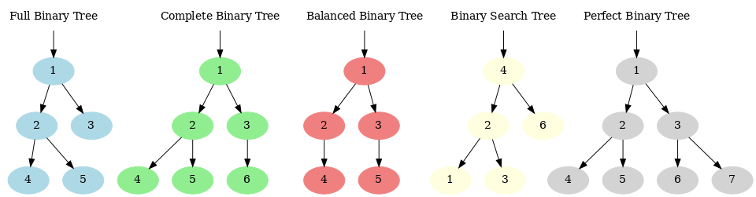
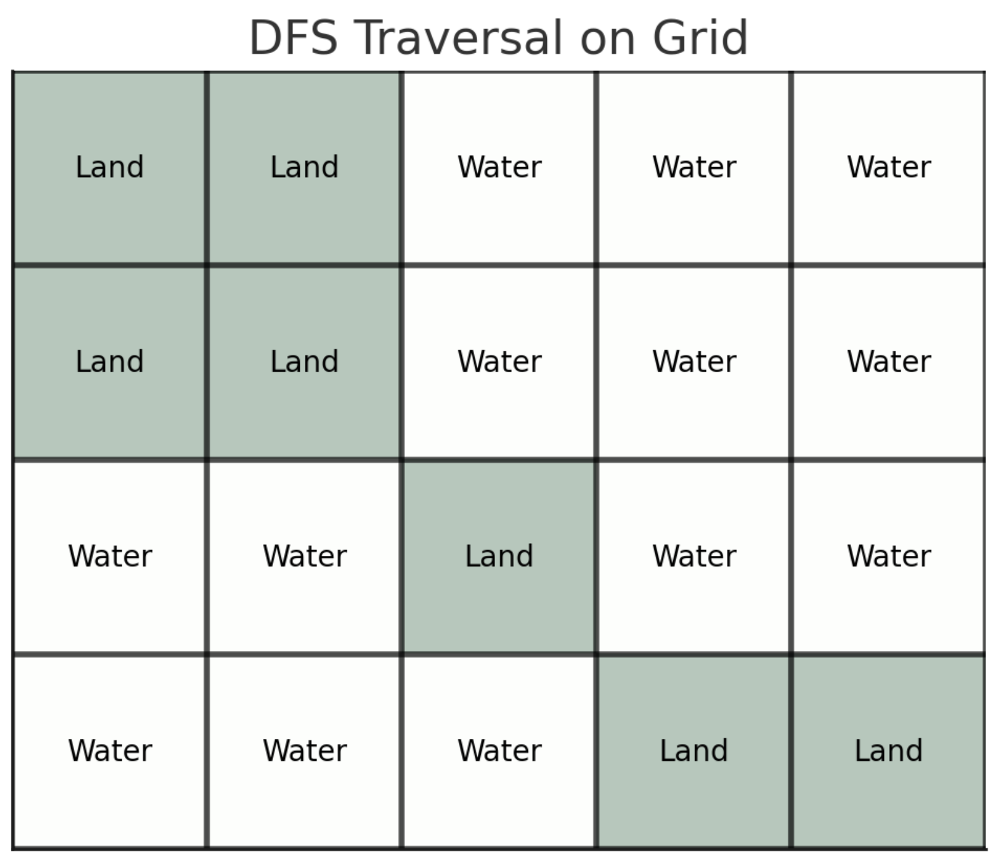
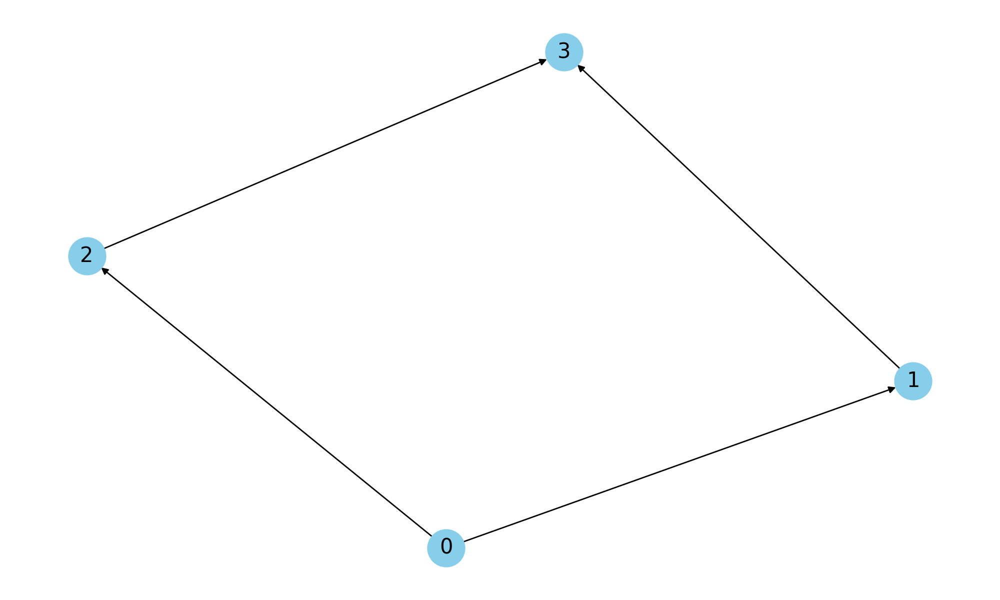

# Note
All the matrials in this page are generated using the following custom GPT:

🚀 **[Software Interview Mentor](https://chat.openai.com/g/g-n76b8bWJo-software-interview-mentor)** - Learn about different concepts! 🤖 (Requires ChatGPT Plus)

# LeetCode Cheatsheet
🚀 **[LeetCode Cheatsheet](https://leetcode.com/explore/interview/card/cheatsheets/720/resources/4723/)** - Great resource for templates of how to write code for each algorithm pattern. Super helpful to review!

# Python Notes

## Dunder or Magic Methods
In Python, methods that have double underscores (`__`) before and after their names are called "dunder methods," short for "double underscore." These are also often referred to as "magic methods." They are special methods that Python uses to provide its classes with specific behaviors. These are not typically called directly by the user but are invoked internally by the Python interpreter to perform specific operations or to interact with built-in functions.

Here are a few examples and their uses:

1. `__init__(self, ...)`: The constructor method for a class. It's called when an instance is created.
2. `__getitem__(self, key)`: Allows an object to use indexing and slicing operations (like `obj[key]`).
3. `__len__(self)`: Should return the length of the object, and is called by the `len()` function.
4. `__str__(self)`: Returns a human-readable string representation of the object, invoked by the `str()` built-in function and also used by the `print()` function.
5. `__repr__(self)`: Returns an official string representation of the object that can ideally be used to recreate the object. `repr()` function uses this method.
6. `__add__(self, other)`: Defines behavior for the addition operator `+`.
7. `__eq__(self, other)`: Defines behavior for the equality operator `==`.
8. `__iter__(self)`: Should return an iterator for the object. This method allows objects to be used in loops.
9. `__or__(self, other)`: Defines behavior for the bitwise OR operator `|` for custom classes. Note that this is for bitwise operations, which differ from logical operations typically used with boolean values. However, in Python, if you define this method, you can use the `|` operator for logical OR operations for instances of your class if that's the intended design.
11. `__and__(self, other)`: Defines behavior for the bitwise AND operator `&` for custom classes. Like `__or__`, it's officially for bitwise operations but can be adapted for logical AND operations between class instances.

These methods allow developers to utilize Python’s built-in language features with their own user-defined objects and can be overridden to customize the behavior of these operations.

> :star2: **Fun Fact:** [LangChain's LCEL](https://python.langchain.com/v0.1/docs/expression_language/) overwrites the `__or__` magic/dunder method to connect sequential blocks!


# Data Structure Notes

Below is a table comparing different data structures commonly used in programming for storing collections of data: `HashSet`, `HashMap`, and the more general `Set`. In addition, I'll add the `List` data structure to provide a broader perspective, as it's another fundamental collection type.

Your provided comparison table and discussion provide a clear and well-structured overview of the differences among these data structures. However, I'll refine the language for clarity and conciseness, and ensure that all points are accurate and effectively communicated. Let's polish this content for better understanding:

---

## Comparison of Common Data Structures: `HashSet`, `HashMap`, `Set`, `List`, and `Bloom Filter`

### Introduction

In programming, managing collections of data efficiently is crucial for performance and effectiveness. Data structures like `HashSet`, `HashMap`, `Set`, `List`, and `Bloom Filter` are tailored for specific uses such as searching, inserting, deleting, or ensuring uniqueness. The choice of data structure depends on the application's needs, including requirements for key-value associations, maintenance of order, or fast access.

### Comparison Table

| Feature/Structure      | HashSet                        | HashMap                                  | Set                          | List                                | Bloom Filter                                         |
|------------------------|--------------------------------|------------------------------------------|------------------------------|-------------------------------------|------------------------------------------------------|
| **Description**        | Stores unique elements without associated data. | Stores key-value pairs with unique keys. | Collection of unique elements, similar to `HashSet`. | Ordered collection allowing duplicates. | Probabilistic structure for space-efficient membership queries with possible false positives. |
| **Element Uniqueness** | Yes                            | Keys unique; values can duplicate.       | Yes                          | No                                  | No actual elements stored; uses hashing for checks. |
| **Order Preservation** | No                             | No                                       | No                           | Yes                                 | No                                                   |
| **Search Efficiency**  | O(1) average                   | O(1) average for keys                    | O(1) average                 | O(n)                                | O(1)                                                 |
| **Insert Efficiency**  | O(1) average                   | O(1) average                             | O(1) average                 | O(1) typically, O(n) for end insertions | O(1)                                                 |
| **Delete Efficiency**  | O(1) average                   | O(1) average                             | O(1) average                 | O(n)                                | Not supported                                        |
| **Typical Usage**      | Ensuring no duplicates in membership checks. | Quick lookup by keys for associated values. | Uniqueness in operations like unions or intersections. | Sequential storage with index-based access. | Efficient where acceptable error rate and space efficiency are crucial (e.g., caching). |
| **Example**            | Attendance systems with unique IDs. | User info retrieval by ID.              | Mathematical set operations. | Playlists or ordered tasks.          | Network systems to check crawled URLs or spam filtering. |

### Key Takeaways

- **HashSet** and **Set** are ideal for scenarios requiring the presence of unique elements without association to other data.
- **HashMap** provides an efficient means to manage associations between unique keys and their corresponding values.
- **List** is preferred where element order is important and needs to be maintained, with efficient positional access.
- **Bloom Filter** offers a space-saving, probabilistic approach, ideal for large datasets where a low error probability is tolerable. It's particularly useful in scenarios like network systems or cache mechanisms.

### Additional Notes on Bloom Filters
- **False Positives**: Bloom filters can mistakenly indicate the presence of an element due to hash collisions.
- **No False Negatives**: If a Bloom filter reports an element as absent, it is definitively not present.
- **No Element Removal**: Bloom filters do not support direct element removal as it would affect the integrity of other elements due to shared hash functions.

## Sample Implementation of Common Data Structures in Python
Here we present sample implementations of data structures in Python. The implementations are not necessarily optimal and may not match the expected time complexities.

### 1. Arrays (Dynamic Arrays in Python)
Python's list is a dynamic array. Let’s implement a simple dynamic array class to better understand its behavior.

```python
class DynamicArray:
    def __init__(self):
        self.n = 0  # Number of elements in the array
        self.capacity = 1  # Initial capacity
        self.A = [None] * self.capacity
    
    def __len__(self):
        return self.n
    
    def __getitem__(self, k):
        if not 0 <= k < self.n:
            return IndexError('K is out of bounds!')
        return self.A[k]
    
    def append(self, element):
        if self.n == self.capacity:
            self._resize(2 * self.capacity)  # Resize array if capacity is reached
        self.A[self.n] = element
        self.n += 1
    
    def _resize(self, new_cap):
        B = [None] * new_cap
        for k in range(self.n):
            B[k] = self.A[k]
        self.A = B
        self.capacity = new_cap

# Example usage:
arr = DynamicArray()
arr.append(1)
arr.append(2)
print(arr[0])  # Outputs: 1
print(arr[1])  # Outputs: 2
print(len(arr))  # Outputs: 2
```
**Time Complexity:**
- Access: $O(1)$
- Append: Amortized $O(1)$
- Resize: $O(n)$

**Space Complexity:** $O(n)$

### 2. Linked List
Here's a simple implementation of a singly linked list:

```python
class Node:
    def __init__(self, value):
        self.value = value
        self.next = None

class LinkedList:
    def __init__(self):
        self.head = None
    
    def append(self, value):
        if not self.head:
            self.head = Node(value)
        else:
            current = self.head
            while current.next:
                current = current.next
            current.next = Node(value)

    def __str__(self):
        values = []
        current = self.head
        while current:
            values.append(str(current.value))
            current = current.next
        return ' -> '.join(values)

# Example usage:
ll = LinkedList()
ll.append(1)
ll.append(2)
print(ll)  # Outputs: 1 -> 2
```
**Time Complexity:**
- Append: $O(n)$
- Access: $O(n)$

**Space Complexity:** $O(n)$

### 3. Stack
A stack uses LIFO (last-in-first-out) order:

```python
class Stack:
    def __init__(self):
        self.elements = []
    
    def push(self, element):
        self.elements.append(element)
    
    def pop(self):
        if not self.is_empty():
            return self.elements.pop()
        raise IndexError("pop from empty stack")
    
    def peek(self):
        if not self.is_empty():
            return self.elements[-1]
        raise IndexError("peek from empty stack")
    
    def is_empty(self):
        return len(self.elements) == 0

    def __len__(self):
        return len(self.elements)

# Example usage:
stack = Stack()
stack.push(1)
stack.push(2)
print(stack.pop())  # Outputs: 2
print(stack.peek())  # Outputs: 1
print(len(stack))  # Outputs: 1
```
**Time Complexity:**
- Push: $O(1)$
- Pop: $O(1)$
- Peek: $O(1)$

**Space Complexity:** $O(n)$

### 4a. Queue - Simple
A queue uses FIFO (first-in-first-out) order. Here's an implementation using a list:

```python
class Queue:
    def __init__(self):
        self.elements = []

    def enqueue(self, element):
        self.elements.append(element)

    def dequeue(self):
        if self.is_empty():
            raise IndexError("dequeue from empty queue")
        return self.elements.pop(0)

    def front(self):
        if self.is_empty():
            raise IndexError("front from empty queue")
        return self.elements[0]

    def is_empty(self):
        return len(self.elements) == 0

    def __len__(self):
        return len(self.elements)

# Example usage:
queue = Queue()
queue.enqueue(1)
queue.enqueue(2)
print(queue.dequeue())  # Outputs: 1
print(queue.front())    # Outputs: 2
print(len(queue))       # Outputs: 1
```
**Time Complexity:**
- Enqueue: $O(1)$
- Dequeue: $O(n)$ because of the list pop operation from the front
- Front: $O(1)$

**Space Complexity:** $O(n)$

### 4b. Queue - with two stacks
To achieve a dequeue operation with a time complexity of $ O(1) $ in Python without using any external packages, you can modify the `Queue` implementation to use two stacks. This approach leverages two lists (representing stacks) where one stack is used for enqueueing elements and the other for dequeueing them.

Here's how it works:
1. For enqueueing, push the elements into the first stack.
2. For dequeueing, if the second stack is empty, transfer all elements from the first stack to the second stack, reversing their order in the process. Then, pop the elements from the second stack.

This method ensures that each element is moved exactly twice - once into the first stack and once into the second stack - giving an amortized time complexity of $ O(1) $ for dequeue operations.

Here's an updated implementation of the `Queue` class using this approach:

```python
class Queue:
    def __init__(self):
        self.in_stack = []  # Stack for enqueue operations
        self.out_stack = []  # Stack for dequeue operations

    def enqueue(self, element):
        self.in_stack.append(element)

    def dequeue(self):
        if self.is_empty():
            raise IndexError("dequeue from empty queue")
        if not self.out_stack:
            while self.in_stack:
                self.out_stack.append(self.in_stack.pop())
        return self.out_stack.pop()

    def front(self):
        if self.is_empty():
            raise IndexError("front from empty queue")
        if not self.out_stack:
            while self.in_stack:
                self.out_stack.append(self.in_stack.pop())
        return self.out_stack[-1]

    def is_empty(self):
        return not self.in_stack and not self.out_stack

    def __len__(self):
        return len(self.in_stack) + len(self.out_stack)

# Example usage:
queue = Queue()
queue.enqueue(1)
queue.enqueue(2)
print(queue.dequeue())  # Outputs: 1
print(queue.front())    # Outputs: 2
print(len(queue))       # Outputs: 1
```

In this implementation:
- **Enqueue**: Push to the `in_stack`, which is $ O(1) $.
- **Dequeue**: Pop from the `out_stack`. If `out_stack` is empty, elements are transferred from `in_stack` and then popped. This is $ O(1) $ amortized because each element is only moved once from `in_stack` to `out_stack`.
- **Front**: Similar to dequeue, the first element to be dequeued is peeked by ensuring elements are transferred to `out_stack` if it's empty.
- **isEmpty**: Checks if both stacks are empty.
- **Length**: Sum of the lengths of both stacks. 

This approach efficiently uses basic list operations in Python to simulate queue behavior with optimal time complexity for all operations.

### 5. Binary Search Tree
A binary search tree (BST) allows fast lookup, addition, and deletion of items:

```python
class TreeNode:
    def __init__(self, key, val):
        self.key = key
        self.val = val
        self.left = None
        self.right = None

class BinarySearchTree:
    def __init__(self):
        self.root = None

    def insert(self, key, val):
        if not self.root:
            self.root = TreeNode(key, val)
        else:
            self._insert(self.root, key, val)

    def _insert(self, node, key, val):
        if key < node.key:
            if node.left is None:
                node.left = TreeNode(key, val)
            else:
                self._insert(node.left, key, val)
        else:
            if node.right is None:
                node.right = TreeNode(key, val)
            else:
                self._insert(node.right, key, val)

    def find(self, key):
        return self._find(self.root, key)

    def _find(self, node, key):
        if node is None:
            return None
        elif key == node.key:
            return node.val
        elif key < node.key:
            return self._find(node.left, key)
        else:
            return self._find(node.right, key)

# Example usage:
bst = BinarySearchTree()
bst.insert(1, 'A')
bst.insert(2, 'B')
print(bst.find(1))  # Outputs: 'A'
print(bst.find(2))  # Outputs: 'B'
```
**Time Complexity:**
- Insert: Average $O(\log n)$, Worst $O(n)$ if the tree becomes unbalanced like a linked list.
- Find: Average $O(\log n)$, Worst $O(n)$

**Space Complexity:** $O(n)$

### 6. Graphs
Representing a graph using an adjacency list:

```python
class Graph:
    def __init__(self):
        self.graph = {}

    def add_edge(self, u, v):
        if u not in self.graph:
            self.graph[u] = []
        self.graph[u].append(v)

    def get_edges(self, u):
        return self.graph.get(u, [])

# Example usage:
graph = Graph()
graph.add_edge(1, 2)
graph.add_edge(1, 3)
print(graph.get_edges(1))  # Outputs: [2, 3]
```
**Time Complexity:**
- Add Edge: $O(1)$
- Get Edges: $O(1)$ assuming return of the list is direct

**Space Complexity:** $O(V + E)$ where $V$ is the number of vertices and $E$ is the number of edges.

### 7. Hash Table
Implementing a basic hash table using chaining for collision resolution:

```python
class HashTable:
    def __init__(self, size=101):
        self.size = size
        self.table = [[] for _ in range(self.size)]

    def hash_function(self, key):
        return hash(key) % self.size

    def insert(self, key, value):
        idx = self.hash_function(key)
        for i, (k, v) in enumerate(self.table[idx]):
            if k == key:
                self.table[idx][i] = (key, value)
                return
        self.table[idx].append((key, value))

    def find(self, key):
        idx = self.hash_function(key)
       

 for k, v in self.table[idx]:
            if k == key:
                return v
        return None

# Example usage:
ht = HashTable()
ht.insert('key1', 'value1')
ht.insert('key2', 'value2')
print(ht.find('key1'))  # Outputs: 'value1'
```
**Time Complexity:**
- Insert: Average $O(1)$, Worst $O(n)$ if many keys hash to the same index.
- Find: Average $O(1)$, Worst $O(n)$

**Space Complexity:** $O(n)$

# Template starter codes for patterns

## Dynamic Programming


### 1. Top-Down Memoization (Recursive)

This approach uses recursion to break down the problem into smaller subproblems, caching results to avoid redundant calculations.

```python
def solve_top_down(input1, input2):
    memo = {}  # Cache for storing results of subproblems

    def dp(state1, state2):
        if (state1, state2) in memo:  # Check if result is already computed
            return memo[(state1, state2)]
        
        if state1 == 0 or state2 == 0:  # Base case example
            return base_case_result
        
        # Compute results for smaller subproblems recursively
        subproblem_result1 = dp(state1 - 1, state2)  # Recursion for one subproblem
        subproblem_result2 = dp(state1, state2 - 1)  # Recursion for another subproblem

        # Use the results of subproblems to compute the current problem's result
        result = compute_result(subproblem_result1, subproblem_result2)

        memo[(state1, state2)] = result  # Store the computed result in the memo dictionary
        return result

    return dp(input1, input2)

def compute_result(result1, result2):
    # This function should implement the logic to combine result1 and result2
    # For example, it might be adding them, finding the minimum, etc.
    return some_combination(result1, result2)
```

### 2. Bottom-Up Tabulation (Iterative)

This approach fills a table iteratively based on the smallest subproblems, building up to the solution of the original problem. This template is generic.
We may not need an extra space for base case, e.g. the case of [minimum cost of climibing stairs](https://leetcode.com/problems/min-cost-climbing-stairs).
We may also store the previous steps (sub-problems) in a dictionary instead of an array, e.g. `{}` or `defaultdict`.

```python
def solve_bottom_up(input1):
    dp = [0] * (input1 + 1)  # DP array to store the results of subproblems
    dp[0] = base_case_result  # Initialize base case

    for i in range(1, input1 + 1):
        dp[i] = dp[i - 1] + some_value  # Fill dp array iteratively

    return dp[input1]  # Return the result for the original problem
```

# Sliding Window

The sliding window technique is a method used to solve problems that involve arrays or lists, especially when you're asked to find a subarray that satisfies certain conditions. This technique is particularly useful for problems where you need to consider contiguous elements together. The key idea is to maintain a 'window' that slides over the data to examine different subsets of it.

### Basic Concept:
- **Window**: A continuous portion of the array/list.
- **Sliding**: Moving the window's start and end points one element at a time.

### Usage:
1. **Fixed-Size Window**: The window size remains constant as it slides. For example, finding the maximum sum of any consecutive `k` elements.
2. **Variable-Size Window**: The window size changes based on certain conditions. For example, finding the smallest subarray with a sum greater than a given value.

### Python Example - Fixed Size Window:
Let's look at an example where you need to find the maximum sum of any consecutive `k` elements in an array.

```python
def max_sum_subarray(arr, k):
    # Initialize max_sum to 0. This will store the maximum sum found.
    max_sum = 0

    # Calculate the sum of the first 'k' elements in the array.
    # This is our initial window sum.
    window_sum = sum(arr[:k])

    # Loop through the array, but only until len(arr) - k.
    # This is because we are considering 'k' elements at a time,
    # and we stop when we reach the last 'k' elements.
    for i in range(len(arr) - k):
        # Slide the window forward by one element:
        # Subtract the element going out of the window (arr[i])
        # and add the new element entering into the window (arr[i + k]).
        window_sum = window_sum - arr[i] + arr[i + k]

        # Update max_sum if the current window_sum is greater than the previously recorded max_sum.
        max_sum = max(max_sum, window_sum)

    # Return the maximum sum found.
    return max_sum

# Example usage
arr = [1, 4, 2, 10, 23, 3, 1, 0, 20]  # Input array
k = 4  # Number of consecutive elements to consider
print(max_sum_subarray(arr, k))  # Output will be the maximum sum of 4 consecutive elements
```

### Python Example - Variable Size Window:
Now, let's look at a variable-size window problem, like finding the smallest subarray with a sum greater than a given value.

```python
def smallest_subarray_with_given_sum(arr, s):
    # Initialize min_length with infinity. This variable will hold the length of the smallest subarray.
    min_length = float('inf')

    # Initialize window_sum to 0. It will store the sum of elements in the current window.
    window_sum = 0

    # Initialize window_start to 0. It marks the start of the sliding window.
    window_start = 0

    # Iterate over the array using window_end as the end of the sliding window.
    for window_end in range(len(arr)):
        # Add the current element to the window_sum.
        window_sum += arr[window_end]

        # Shrink the window from the start if the window_sum is greater than or equal to s.
        while window_sum >= s:
            # Update min_length with the smaller length between the previous min_length and current window size.
            min_length = min(min_length, window_end - window_start + 1)

            # Subtract the element at window_start from window_sum and move window_start forward.
            window_sum -= arr[window_start]
            window_start += 1

    # Return min_length if a subarray was found; otherwise, return 0.
    # Checking against float('inf') is necessary to handle the case where no such subarray is found.
    return min_length if min_length != float('inf') else 0

# Example usage
arr = [2, 1, 5, 2, 3, 2]  # Input array
s = 7  # Target sum
print(smallest_subarray_with_given_sum(arr, s))  # Output will be the length of the smallest subarray with sum >= s
```

### Real-World Application:
In large-scale systems, the sliding window technique is often used in areas like network data analysis or real-time analytics, where it's essential to analyze a subset of data in a moving time frame. For example, monitoring the maximum traffic load on a server in any given 10-minute window can help in resource allocation and predicting potential overload scenarios.

# Prefix Sum

The Prefix Sum pattern is a powerful technique in algorithms and data structures, particularly useful in solving problems involving arrays or lists. It's about creating an auxiliary array, the prefix sum array, which stores the sum of elements from the start to each index of the original array. This technique simplifies solving problems related to range sum queries and subarray sums.

### Key Concept:
- **Prefix Sum Array:** Given an array `arr`, its prefix sum array `prefixSum` is defined such that `prefixSum[i]` is the sum of all elements `arr[0]`, `arr[1]`, ..., `arr[i]`.

### Advantages:
1. **Efficient Range Queries:** Once the prefix sum array is built, you can quickly find the sum of elements in a range `[i, j]` by simply calculating `prefixSum[j] - prefixSum[i-1]`.
2. **Preprocessing Time-Saver:** Building the prefix sum array takes O(N) time, but once built, range sum queries are O(1).
3. **Versatility:** Useful in various scenarios like calculating cumulative frequency, image processing, and more.

### Real-World Example:
Consider a large-scale system like a finance tracking app. You need to quickly calculate the total expenditure over different time ranges. By using a prefix sum array of daily expenses, you can rapidly compute the sum over any date range, enhancing the performance of the app.

### Python Example:
Let's create a prefix sum array and use it to find a range sum.

```python
def create_prefix_sum(arr):
    # Initialize the prefix sum array with the first element of arr
    prefix_sum = [arr[0]] 

    # Compute the prefix sum array
    for i in range(1, len(arr)):
        prefix_sum.append(prefix_sum[i-1] + arr[i])

    return prefix_sum

def range_sum_query(prefix_sum, start, end):
    # Handle the case when start is 0
    if start == 0:
        return prefix_sum[end]
    return prefix_sum[end] - prefix_sum[start - 1]

# Example usage
arr = [3, 1, 4, 1, 5, 9, 2, 6]
prefix_sum = create_prefix_sum(arr)

# Get the sum of elements from index 2 to 5
print(range_sum_query(prefix_sum, 2, 5))  # Output: 19
```

### LeetCode Style Question:
**Problem - "Subarray Sum Equals K" (LeetCode 560):** Given an array of integers `nums` and an integer `k`, return the total number of continuous subarrays whose sum equals to `k`.

**Solution:**
```python
def subarraySum(nums, k):
    count = 0
    prefix_sum = 0
    sum_freq = {0: 1}

    for num in nums:
        prefix_sum += num
        # Check if there is a prefix sum that, when subtracted from the current prefix sum, equals k
        if prefix_sum - k in sum_freq:
            count += sum_freq[prefix_sum - k]

        # Update the frequency of the current prefix sum
        sum_freq[prefix_sum] = sum_freq.get(prefix_sum, 0) + 1

    return count

# Example usage
print(subarraySum([1, 1, 1], 2))  # Output: 2
```
In this problem, we use a hash map (`sum_freq`) to store the frequency of prefix sums. As we iterate through the array, we check if `prefix_sum - k` is in our map. If it is, it means there are one or more subarrays ending at the current index which sum up to `k`. This approach is efficient and showcases the utility of the prefix sum pattern in solving complex problems.

# Hash Map / Set
The Hash Map/Set pattern in interviews typically revolves around leveraging hash tables to efficiently store, access, and manipulate data. Hash tables, implemented in Python as dictionaries (hash maps) and sets (hash sets), provide average time complexity of O(1) for insert, delete, and lookup operations, making them incredibly efficient for certain types of problems.

### Key Characteristics of Hash Map/Set Pattern:

1. **Efficiency**: The direct access nature of hash maps/sets allows for faster data retrieval compared to linear structures like arrays or linked lists.
2. **Uniqueness**: Sets naturally enforce uniqueness of elements, making them ideal for solving problems involving deduplication or presence checks.
3. **Key-Value Storage**: Hash maps store data in key-value pairs, allowing for efficient data association and retrieval. This is useful for counting frequencies, mapping relationships, etc.
4. **Ordering**: Standard hash maps/sets in Python (as of Python 3.7) maintain insertion order, but it's crucial to remember that the primary feature of hash tables is not ordering but fast access.

### Real-World Example:

Consider a web service that tracks the number of views for various videos. A hash map could efficiently map video IDs to view counts, allowing the service to quickly update or retrieve views for any video. This is critical in large-scale systems where performance and scalability are paramount.

### Common Interview Problems and Solutions:

#### Problem 1: Find the First Unique Character in a String

Given a string, find the first non-repeating character in it and return its index. If it doesn't exist, return -1.

**Solution**:

- Use a hash map to count the frequency of each character.
- Iterate through the string to find the first character with a frequency of 1.

```python
def firstUniqChar(s: str) -> int:
    # Build a hash map to store character frequencies
    char_count = {}
    for char in s:
        if char in char_count:
            char_count[char] += 1
        else:
            char_count[char] = 1

    # Find the first unique character
    for index, char in enumerate(s):
        if char_count[char] == 1:
            return index

    return -1
```

#### Problem 2: Contains Duplicate

Given an array of integers, find if the array contains any duplicates.

**Solution**:

- Use a set to track seen numbers.
- If a number is already in the set, a duplicate exists.

```python
def containsDuplicate(nums: List[int]) -> bool:
    seen = set()
    for num in nums:
        if num in seen:
            return True
        seen.add(num)
    return False
```

### Conclusion

The Hash Map/Set pattern is powerful for problems involving data access and manipulation due to its efficiency and flexibility. By understanding and applying this pattern, you can solve a wide range of problems more effectively in your interviews. Remember to analyze the problem's requirements carefully to determine when using a hash map or set is the most appropriate solution.

# Stack
The Stack interview pattern involves using a stack data structure to solve problems that require you to process elements in a Last-In-First-Out (LIFO) manner. This pattern is particularly useful in scenarios where you need to keep track of previously seen elements in a way that the last element you encounter is the first one you need to retrieve for processing.

### Key Concepts

1. **LIFO Principle**: The last element added to the stack is the first one to be removed.
2. **Operations**: The primary operations involved with stacks are:
   - `push()`: Add an element to the top of the stack.
   - `pop()`: Remove the top element from the stack.
   - `peek()` or `top()`: View the top element without removing it.
   - `isEmpty()`: Check if the stack is empty.

### Use Cases

- **Parentheses Matching**: Checking for balanced parentheses in an expression.
- **Undo Mechanism**: In text editors, browsers, etc., where the last action can be undone.
- **Function Call Management**: Managing function calls in programming languages, where the call stack is a stack.
- **Histogram Problems**: Calculating maximum area under histograms.
- **String Manipulations**: Reversing strings or checking for palindromes.

### Python Example: Checking for Balanced Parentheses

Let's explore a common interview question solved using the stack pattern: checking if an expression has balanced parentheses.

```python
def isBalanced(expression):
    # Stack to keep track of opening brackets
    stack = []
    
    # Mapping of closing to opening brackets
    mapping = {')': '(', '}': '{', ']': '['}
    
    for char in expression:
        if char in mapping:
            # Pop the top element if the stack isn't empty, else assign a dummy value
            top_element = stack.pop() if stack else '#'
            
            # Check if the popped element matches the mapping
            if mapping[char] != top_element:
                return False
        else:
            # Push the opening bracket onto the stack
            stack.append(char)
    
    # The expression is balanced if the stack is empty
    return not stack

# Example usage
expression = "{[()()]}"
print(isBalanced(expression))  # Output: True
```

### Real-world Example

Imagine implementing a feature for a text editor that allows users to undo their last set of actions. A stack can be used to store actions as they occur. When the user triggers the undo function, the most recent action is popped from the stack and reversed. This LIFO approach ensures that actions are undone in the reverse order they were made, which is a common expectation in user interfaces.

### Solving a LeetCode Problem: Largest Rectangle in Histogram

One of the more challenging problems that can be solved using the stack pattern is finding the largest rectangle in a histogram. This involves processing bars in a histogram to find the largest rectangle that can be formed within the bounds of the histogram. The problem definition: Given an array of integers (heights) representing the histogram's bar height where the width of each bar is 1, return the area of the largest rectangle in the histogram. The challenging part is that different bars from the histogram can be combined to represent a larger rectangle as visualized in [this Leetcode problem](https://leetcode.com/problems/largest-rectangle-in-histogram/description/). Good explanation by [NeetCode](https://www.youtube.com/watch?v=zx5Sw9130L0).

```python
def largestRectangleArea(heights):
    stack = []  # Create a stack to keep indices of the bars
    max_area = 0  # Initialize max area as zero
    
    # Iterate through all bars of the histogram
    for i, h in enumerate(heights):
        start = i
        while stack and stack[-1][1] > h:
            index, height = stack.pop()
            max_area = max(max_area, height * (i - index))
            start = index
        stack.append((start, h))
    
    # Compute area for the remaining bars in stack
    for i, h in stack:
        max_area = max(max_area, h * (len(heights) - i))
    
    return max_area

# Example usage
heights = [2,1,5,6,2,3]
print(largestRectangleArea(heights))  # Output: 10
```

In this code, we maintain a stack to keep track of bars. When we see a bar that is lower than the bar at the top of the stack, we start calculating the area with the bar at the top as the smallest bar. We do this because the current bar stops the previous bars from extending further. This solution efficiently processes each bar and determines the area of the largest rectangle that can be formed.

### LIFO Stack with List

Implementing a LIFO stack with a list is straightforward since lists naturally support append and pop operations at the end, which are efficient and align with the LIFO principle.

```python
# LIFO Stack Implementation
stack = []

# Push items onto the stack
stack.append('A')
stack.append('B')
stack.append('C')

# Pop an item off the stack
last_in = stack.pop()
print("Popped Item:", last_in)  # C

# The stack now contains: ['A', 'B']
```

### FIFO Queue with List

For a FIFO queue, you can still use a list, but you should be aware of the performance implications. Using `append()` to enqueue and `pop(0)` to dequeue will work, but `pop(0)` has a linear time complexity (O(n)) because it requires shifting all other elements by one.

```python
# FIFO Queue Implementation (Not Recommended for High Performance Needs)
queue = []

# Enqueue items
queue.append('A')
queue.append('B')
queue.append('C')

# Dequeue an item
first_in = queue.pop(0)
print("Dequeued Item:", first_in)  # A

# The queue now contains: ['B', 'C']
```

### Recommended Approach for FIFO in Interviews

For interviews, it's essential to discuss the efficiency of your data structure choices. If asked to implement a FIFO queue, it’s better to mention or use collections.deque, which is designed to have fast appends and pops from both ends.

```python
from collections import deque

# FIFO Queue Implementation using deque
queue = deque()

# Enqueue items
queue.append('A')
queue.append('B')
queue.append('C')

# Dequeue an item
first_in = queue.popleft()
print("Dequeued Item:", first_in)  # A

# The queue now contains: deque(['B', 'C'])
```

### Summary for Interviews

- For LIFO stack operations, using a list is perfectly fine and recommended due to its simplicity and efficiency for stack-related operations.
- For FIFO queue operations, prefer using `collections.deque` to avoid performance issues associated with list operations that affect the beginning of the list. Mentioning the efficiency concern shows your understanding of underlying data structures and their performance characteristics.

Explaining your choice of data structure and being aware of its performance implications can positively impact your interview, demonstrating both your coding skills and your understanding of data structures.

## Trie
The Trie algorithm pattern, often referred to as a prefix tree, is a specialized tree used to handle a dynamic set of strings where keys are usually strings. Unlike binary search trees, where the position of a node is determined by comparing the less than or greater than relationship to the parent node, in a Trie, the position of a node is determined by the characters in the string it represents. This makes Tries an incredibly efficient data structure for tasks such as autocomplete, spell checking, IP routing, and other applications where prefix matching is important.

### Structure of a Trie

A Trie is a rooted tree with nodes that contain a set of children per node, each representing one character of the alphabet. Here's a basic structure of a Trie node:

```python
class TrieNode:
    def __init__(self):
        self.children = {}
        self.is_end_of_word = False
```

- `children`: A dictionary mapping characters to the next TrieNode.
- `is_end_of_word`: A boolean indicating whether this node represents the end of a word in the Trie.

### Basic Operations

#### Insertion

To insert a word into a Trie, start from the root and traverse the Trie following the characters of the word. If a character is not present, create a new node in the corresponding child position. Mark the end node as the end of a word.

```python
class Trie:
    def __init__(self):
        self.root = TrieNode()
    
    def insert(self, word):
        node = self.root
        for char in word:
            if char not in node.children:
                node.children[char] = TrieNode()
            node = node.children[char]
        node.is_end_of_word = True
```

#### Search

To search for a word, traverse the Trie following the characters of the word. If at any step the character is not found, return False. If all characters are found and the last node is marked as the end of a word, return True.

```python
def search(self, word):
    node = self.root
    for char in word:
        if char not in node.children:
            return False
        node = node.children[char]
    return node.is_end_of_word
```

#### Prefix Search

This operation checks whether there is any word in the Trie that starts with the given prefix.

```python
def startsWith(self, prefix):
    node = self.root
    for char in prefix:
        if char not in node.children:
            return False
        node = node.children[char]
    return True
```

### Real-world Example

Consider an autocomplete system, like the ones used in search engines or messaging apps. A Trie can efficiently store a large dictionary of words and quickly retrieve all words that share a common prefix, which is essential for suggesting completions as the user types.

### Example Problem: Implement an Autocomplete System

Let's design a basic autocomplete system using a Trie. For simplicity, we'll focus on inserting words and finding completions for a given prefix.

```python
class AutocompleteSystem:
    def __init__(self, words):
        self.trie = Trie()
        for word in words:
            self.trie.insert(word)
    
    def autocomplete(self, prefix):
        completions = []
        node = self.trie.root
        for char in prefix:
            if char not in node.children:
                return []
            node = node.children[char]
        self.dfs(node, prefix, completions)
        return completions
    
    def dfs(self, node, prefix, completions):
        if node.is_end_of_word:
            completions.append(prefix)
        for char, child_node in node.children.items():
            self.dfs(child_node, prefix + char, completions)
```

In this example, `AutocompleteSystem` initializes a Trie with a list of words. The `autocomplete` function finds all words in the Trie that start with a given prefix, using depth-first search to traverse and collect completions.

Tries are a powerful tool for working with strings and can significantly improve the performance and efficiency of your code in scenarios involving prefix matching and word retrieval.

### Example Problem: Equal Row and Column Pairs using Trie
LeetCode problem 2352, "Equal Row and Column Pairs," asks for finding pairs of rows and columns in a square matrix that are identical. At first glance, using a Trie for this problem might not seem intuitive since Tries are typically used for string manipulations or prefix-related queries. However, with a creative approach, we can adapt the Trie data structure to solve this problem efficiently by treating each row and column as a string of numbers.

#### Problem Statement

Given an `n x n` integer matrix `grid`, return the number of pairs `(r, c)` where row `r` and column `c` are identical.

#### Approach

To solve this problem, we'll insert each row of the matrix into a Trie, treating each row as a "word" where each "character" is an element of the row. After inserting all rows, we'll traverse each column of the matrix, checking if the column exists in the Trie as if we were searching for a word.

Here's how we can implement this approach:

1. **Trie Node Structure**: Each Trie node will hold a dictionary mapping the next digit to the next Trie node, and a count to track how many times a "word" (in this case, a row) ends at this node.

2. **Insert Rows**: For each row in the grid, insert it into the Trie.

3. **Search Columns**: For each column, traverse the Trie. If we can successfully traverse the Trie using the column's elements as the path and find nodes that represent the end of rows, we increment our pairs count based on the count stored in the final node of that path.

#### Python Implementation

```python
class TrieNode:
    def __init__(self):
        self.children = {}
        self.endCount = 0  # Tracks how many rows end at this node

class Trie:
    def __init__(self):
        self.root = TrieNode()

    def insert(self, row):
        node = self.root
        for num in row:
            if num not in node.children:
                node.children[num] = TrieNode()
            node = node.children[num]
        node.endCount += 1  # Mark the end of a row and count it

def equalPairs(grid):
    n = len(grid)
    trie = Trie()
    
    # Insert all rows into the Trie
    for row in grid:
        trie.insert(row)
    
    pairCount = 0
    
    # Check each column against the Trie
    for c in range(n):
        node = trie.root
        for r in range(n):
            if grid[r][c] in node.children:
                node = node.children[grid[r][c]]
            else:
                break  # This column does not match any row
        else:  # If we didn't break, this column matches a row
            pairCount += node.endCount
    
    return pairCount
```

#### Explanation

- **Inserting Rows**: We insert each row into the Trie, treating each element of the row as a part of a path in the Trie. The `endCount` at the last node of each path is incremented to indicate the end of a row and how many times it appears.
  
- **Searching for Columns**: For each column, we attempt to follow a path in the Trie corresponding to the column's elements. If we reach the end of the path (`else` clause of the loop), it means the column matches one or more rows, and we add the `endCount` of the final node to `pairCount`.

This solution leverages the Trie data structure to efficiently compare rows and columns, exploiting the fact that both rows and columns can be treated as sequences of numbers, similar to strings in traditional Trie use cases.

# Queue
Queues are a fundamental data structure that operates on a First In, First Out (FIFO) principle, meaning the first element added to the queue will be the first one to be removed. This characteristic makes queues incredibly useful for managing tasks in sequential order, simulating real-world scenarios like customer service lines, and handling data in streams.

### Real-World Example: Web Server Request Handling

In large-scale systems, like web servers, queues play a critical role in managing incoming requests. When a server receives more requests than it can process simultaneously, it places the excess requests in a queue. This ensures that each request is handled in the order it was received, preventing server overload and maintaining fair access for users.

### Python Implementation

In Python, queues can be implemented using the `queue` module for thread-safe operations, or simply with a list, although the latter is not recommended for production due to performance issues when the list grows.

```python
from queue import Queue

# Initialize a queue
q = Queue()

# Add elements
q.put('A')
q.put('B')

# Remove and return an element
first_element = q.get()

print(first_element)  # Output: 'A'
```

### Queue in Leetcode Problems

Queues are especially useful in solving problems related to graph traversal (like BFS), caching strategies (like LRU Cache), and more. Let's look at a classic Leetcode problem to illustrate the use of queues.

#### Example: Binary Tree Level Order Traversal (Leetcode 102)

Given a binary tree, return the level order traversal of its nodes' values. (i.e., from left to right, level by level).

```python
# Definition for a binary tree node.
class TreeNode:
    def __init__(self, val=0, left=None, right=None):
        self.val = val
        self.left = left
        self.right = right

from collections import deque

def levelOrder(root):
    if not root:
        return []

    result = []
    queue = deque([root])

    while queue:
        level_size = len(queue)
        level = []

        for _ in range(level_size):
            node = queue.popleft()
            if node:
                level.append(node.val)
                if node.left:
                    queue.append(node.left)
                if node.right:
                    queue.append(node.right)
        
        result.append(level)

    return result

# Usage example
# Assume a binary tree is defined here
# print(levelOrder(root))
```

In this solution, a `deque` from the `collections` module is used as a queue to hold nodes at each level of the tree. The while loop continues as long as there are nodes to process, and for each loop iteration, it processes nodes that are at the same depth level. This ensures a level-by-level traversal of the tree, aligning perfectly with the FIFO nature of queues.

### Comments and Teaching Points

- **Choosing the Right Data Structure:** The choice of `deque` over a list for queue operations is due to its efficient append and pop operations from both ends.
- **Level-by-Level Processing:** The use of a loop within a loop allows for processing all nodes at a given depth before moving on to the nodes at the next depth, which is crucial for level order traversal in trees.

Queues offer a versatile tool in algorithm design, particularly for problems requiring sequential processing or breadth-first search. Their implementation and application can greatly simplify the solution to complex problems, making them a vital concept for software interview preparation.

# Linked List

Linked lists are a fundamental data structure in computer science, widely used for their flexibility and efficiency in certain types of operations. A linked list is a collection of nodes, where each node contains data and a reference (or link) to the next node in the sequence. This structure allows for efficient insertion and deletion of elements, as these operations do not require the data to be contiguous in memory.

### Types of Linked Lists

- **Singly Linked List:** Each node has data and a reference to the next node.
- **Doubly Linked List:** Each node has data and two references—one to the next node and one to the previous node, allowing for traversal in both directions.
- **Circular Linked List:** Similar to a singly or doubly linked list, but the last node references the first node, creating a circular structure.

### Advantages of Linked Lists

- **Dynamic Size:** Unlike arrays, linked lists can grow and shrink in size without the need for reallocation or resizing.
- **Efficient Insertions/Deletions:** Adding or removing elements from the beginning or middle of the list does not require shifting elements, as in the case of arrays.

### Disadvantages of Linked Lists

- **Random Access:** Direct access to an element (e.g., via index) is not possible. One must traverse the list from the beginning to reach a specific element, which can be inefficient.
- **Memory Overhead:** Each node requires additional memory for the reference (pointer) in addition to the data.

### Example in Python: Implementing a Singly Linked List

Here's a basic implementation of a singly linked list in Python 3, demonstrating how to define a node, insert elements, and traverse the list.

```python
class ListNode:
    def __init__(self, value=0, next=None):
        self.value = value
        self.next = next

class LinkedList:
    def __init__(self):
        self.head = None  # The list is initially empty

    def insert_at_head(self, value):
        # Create a new node with the given value and set it as the new head of the list
        new_node = ListNode(value)
        new_node.next = self.head
        self.head = new_node

    def print_list(self):
        # Traverse the list and print each node's value
        current_node = self.head
        while current_node:
            print(current_node.value, end=' -> ')
            current_node = current_node.next
        print('None')

# Usage
linked_list = LinkedList()
linked_list.insert_at_head(3)
linked_list.insert_at_head(2)
linked_list.insert_at_head(1)
linked_list.print_list()
```

This example demonstrates the basics of working with linked lists, including node creation, list traversal, and insertion at the head of the list.

### Real-World Example: Undo Functionality in Applications

A common real-world use of linked lists is to implement undo functionality in applications. Each node in the linked list can represent a state of the document or application. When the user makes a change, a new state is added to the list. To undo an action, the application can revert to the previous node's state. This is efficient because each state change doesn't require copying the entire document's state, just the differences.

### Conclusion

Linked lists are a versatile and essential data structure, particularly useful where efficient insertions and deletions are crucial. While they come with trade-offs such as lack of random access and additional memory overhead for pointers, their benefits often make them the data structure of choice for certain problems and scenarios in software development.

# Binary Trees
Binary trees are a foundational concept in computer science, used to model hierarchical data structures. They consist of nodes connected by edges, where each node contains a value and pointers to two child nodes, conventionally referred to as the left child and the right child. The topmost node is called the root of the tree. A binary tree is characterized by the fact that each node can have at most two children, which differentiates it from other types of trees where a node could have any number of children.

### Key Properties:
- **Depth of a Node**: The number of edges from the root to the node.
- **Height of a Tree**: The number of edges on the longest downward path between the root and a leaf.
- **Full Binary Tree**: Every node other than the leaves has two children.
- **Complete Binary Tree**: All levels are fully filled except possibly the last level, which is filled from left to right.
- **Balanced Binary Tree**: The height of the two subtrees of any node differ by no more than one.
- **Binary Search Tree (BST)**: A special kind of binary tree where the left child node is less than the parent node, and the right child node is greater than the parent node.
- **Perfect Binary Tree**: A perfect binary tree is a type of binary tree in which every internal node has exactly two children, and all leaf nodes are at the same depth or level. This means it's both "full" and "complete." In a perfect binary tree, there are exactly $2^k - 1$ nodes (where $k$ is the number of levels).

### Visualizing Differences:
- **Full Binary Tree** can have some leaves at different levels, but every node must either have 2 or no children.
- **Complete Binary Tree** ensures that all levels are filled except possibly the last one, which is filled from left to right.
- **Balanced Binary Tree** focuses on ensuring that the height difference between left and right subtrees is no more than one, without strict requirements on how each level is filled.
- **Binary Search Tree (BST)** prioritizes the order of elements (left < parent < right) without imposing structural completeness.
- **Perfect Binary Tree** combines the fullness of a "Full Binary Tree" with the level completion aspect, ensuring every level is completely filled, making it symmetrical.


*<small>Illustration of Different Types of Binary Trees.</small>*

### Examples:

```python
class TreeNode:
    def __init__(self, val=0, left=None, right=None):
        self.val = val
        self.left = left
        self.right = right

# Example of creating a simple binary tree
#       1
#      / \
#     2   3
root = TreeNode(1)
root.left = TreeNode(2)
root.right = TreeNode(3)
```

### Real World Implications:
Binary trees are crucial in many computing algorithms and systems. They're used in database indexes for efficient data retrieval, in sorting algorithms like heapsort (via binary heaps), and in decision-making processes such as those found in machine learning decision trees. Binary search trees, a subtype of binary trees, are especially useful for searching and sorting operations due to their ability to reduce the search space by half at each step.

### Fundamental LeetCode Problems:

1. **Invert a Binary Tree (LeetCode #226)**

The problem involves flipping a binary tree around its center, meaning the left child becomes the right child and vice versa for every node in the tree.

- **Solution Approach**: A recursive strategy works well here. For each node, we swap its left and right children, then proceed to invert the left and right subtrees recursively.

```python
def invertTree(root):
    if not root:
        return None
    # Swap the left and right child
    root.left, root.right = root.right, root.left
    # Recursively invert the subtrees
    invertTree(root.left)
    invertTree(root.right)
    return root
```

- **Time Complexity**: O(n), where n is the number of nodes, since we visit each node exactly once.
- **Space Complexity**: O(h), where h is the height of the tree. This space is used by the call stack during the recursion.

2. **Maximum Depth of Binary Tree (LeetCode #104)**

This problem requires finding the maximum depth (or height) of a binary tree, which is the longest path from the root node down to the farthest leaf node.

- **Solution Approach**: We can solve this using recursion by computing the height of the left and right subtrees. The maximum depth at any node will be the max depth of its subtrees plus one (for the current node).

```python
def maxDepth(root):
    if not root:
        return 0
    # Recursively find the depth of the left and right subtrees
    left_depth = maxDepth(root.left)
    right_depth = maxDepth(root.right)
    # The depth of the current node is max of left and right depths plus one
    return max(left_depth, right_depth) + 1
```

- **Time Complexity**: O(n), as we need to visit each node.
- **Space Complexity**: O(h), due to the recursion stack, where h is the height of the tree.

Through these examples, we see the elegance and efficiency binary trees bring to solving complex problems, highlighting their importance in software development and algorithm design.

# Depth-First Search (DFS) in Binary Trees
Binary Tree Depth First Search (DFS) is a fundamental algorithmic technique used to explore and process all the nodes in a binary tree. Unlike Breadth-First Search (BFS) that explores the tree level-by-level, DFS goes as deep as possible down one path before backing up and trying another. In the context of binary trees, this means moving through the tree by visiting a node's child before visiting its sibling. DFS is particularly useful for tasks that need to explore all possible paths or need to process a tree in a specific order (preorder, inorder, or postorder).

### Variants of DFS in Binary Trees

There are three primary ways to perform DFS in a binary tree:

1. **Preorder Traversal**: Visit the current node before its children. The process follows the sequence: Visit -> Go Left -> Go Right.
2. **Inorder Traversal**: Visit the left child, then the current node, and finally the right child. This sequence: Go Left -> Visit -> Go Right results in visiting nodes in ascending order in a binary search tree.
3. **Postorder Traversal**: Visit the current node after its children. The sequence is: Go Left -> Go Right -> Visit.

### Examples

To make these concepts clear, let's consider a binary tree:

```
    A
   / \
  B   C
 / \   \
D   E   F
```

- **Preorder Traversal**: A -> B -> D -> E -> C -> F
- **Inorder Traversal**: D -> B -> E -> A -> C -> F
- **Postorder Traversal**: D -> E -> B -> F -> C -> A

### Real-world Implications

In real-world applications, DFS is invaluable for hierarchical data structures and scenarios like:
- **Web Crawling**: Where a DFS approach can explore a website's links deeply before moving to adjacent links.
- **Solving Puzzles**: Such as mazes, where DFS can explore each possible path to completion before backtracking.
- **Dependency Resolution**: In systems like package managers where dependencies must be installed before the package that requires them.

### LeetCode Problems

Let's apply DFS to solve two fundamental LeetCode problems:

1. **Maximum Depth of Binary Tree** (LeetCode Problem 104): Find the maximum depth of a binary tree.
2. **Path Sum** (LeetCode Problem 112): Determine if the tree has a root-to-leaf path such that adding up all the values along the path equals a given sum.

I'll now solve these problems with detailed, commented Python code to demonstrate DFS in action.

#### Problem 1: Maximum Depth of Binary Tree

First, let's tackle finding the maximum depth of a binary tree.

```python
# Definition for a binary tree node.
class TreeNode:
    def __init__(self, val=0, left=None, right=None):
        self.val = val
        self.left = left
        self.right = right

def maxDepth(root):
    """
    :type root: TreeNode
    :rtype: int
    """
    if not root:
        return 0  # Base case: if the node is null, depth is 0
    
    # Recursive DFS on left and right subtrees to find their depth
    left_depth = maxDepth(root.left)
    right_depth = maxDepth(root.right)
    
    # The depth of the current node is max of left and right subtree depths + 1
    return max(left_depth, right_depth) + 1
```

#### Problem 2: Path Sum

Next, let's solve the problem of checking if a tree has a root-to-leaf path with a given sum.

```python
def hasPathSum(root, sum):
    """
    :type root: TreeNode
    :type sum: int
    :rtype: bool
    """
    if not root:
        return False  # Base case: if the node is null, it can't contribute to the sum
    
    # Check if it's a leaf node and the path sum matches the required sum
    if not root.left and not root.right and root.val == sum:
        return True
    
    # Subtract the current node's value from sum and recursively check left and right subtrees
    sum -= root.val
    return hasPathSum(root.left, sum) or hasPathSum(root.right, sum)
```

These solutions exemplify how DFS can be applied to binary trees to solve complex problems efficiently. The time complexity for both problems is $O(N)$, where $N$ is the number of nodes in the tree, as we potentially visit each node once. The space complexity is $O(H)$, where $H$ is the height of the tree, due to the call stack during the recursion, which in the worst case can be $O(N)$ for a skewed tree but is generally $O(log N)$ for a balanced tree.

## When to use Preorder, Inorder, or Postorder?

Understanding when to use preorder, inorder, and postorder traversals in depth-first search (DFS) of binary trees is foundational for solving various types of problems. Each traversal order offers a unique approach to exploring the nodes of a binary tree, and selecting the right one depends on the specific requirements of the problem you're trying to solve.

### Preorder Traversal (Root, Left, Right)
Preorder traversal is used when you need to explore roots before inspecting leaves. It's useful in problems where you need to replicate the tree structure or when the process of visiting a node includes operations that depend on information from the parent node.

**Real-world implication**: Imagine a filesystem where directories and files are structured as a binary tree. Preorder traversal could be used to copy the filesystem, where you need to create a directory before you can create its subdirectories and files.

**LeetCode Example**: [LeetCode Problem 144 - Binary Tree Preorder Traversal](https://leetcode.com/problems/binary-tree-preorder-traversal/)

#### Solution:
```python
# Definition for a binary tree node.
class TreeNode:
    def __init__(self, val=0, left=None, right=None):
        self.val = val
        self.left = left
        self.right = right

def preorderTraversal(root):
    """
    :type root: TreeNode
    :rtype: List[int]
    """
    if not root:
        return []
    
    # The preorder traversal list
    traversal = []
    
    # Define a recursive function to perform preorder traversal
    def preorder(node):
        if not node:
            return
        traversal.append(node.val)  # Visit the root
        preorder(node.left)         # Traverse left subtree
        preorder(node.right)        # Traverse right subtree
    
    preorder(root)
    return traversal
```

### Inorder Traversal (Left, Root, Right)
Inorder traversal is particularly useful for binary search trees (BST), where it returns nodes in non-decreasing order. This property makes inorder traversal ideal for problems that require sorted data from a BST.

**Real-world implication**: For a BST representing a sequence of events ordered by time, inorder traversal can list the events in chronological order.

**LeetCode Example**: [LeetCode Problem 94 - Binary Tree Inorder Traversal](https://leetcode.com/problems/binary-tree-inorder-traversal/)

#### Solution:
```python
def inorderTraversal(root):
    """
    :type root: TreeNode
    :rtype: List[int]
    """
    if not root:
        return []
    
    traversal = []
    
    def inorder(node):
        if not node:
            return
        inorder(node.left)         # Traverse left subtree
        traversal.append(node.val)  # Visit the root
        inorder(node.right)        # Traverse right subtree
    
    inorder(root)
    return traversal
```

### Postorder Traversal (Left, Right, Root)
Postorder traversal is used when you need to visit all children nodes before you deal with the node itself. This approach is useful for problems that require a bottom-up solution, such as calculating the height of the tree or deleting the tree.

**Real-world implication**: In a project dependency graph represented as a binary tree, postorder traversal can ensure that dependent tasks are completed before a parent task starts.

**LeetCode Example**: [LeetCode Problem 145 - Binary Tree Postorder Traversal](https://leetcode.com/problems/binary-tree-postorder-traversal/)

#### Solution:
```python
def postorderTraversal(root):
    """
    :type root: TreeNode
    :rtype: List[int]
    """
    if not root:
        return []
    
    traversal = []
    
    def postorder(node):
        if not node:
            return
        postorder(node.left)         # Traverse left subtree
        postorder(node.right)        # Traverse right subtree
        traversal.append(node.val)  # Visit the root
    
    postorder(root)
    return traversal
```

# Binary Tree - Breadth-First Search (BFS)

Let's dive deep into the Binary Tree Breadth-First Search (BFS) pattern, a fundamental and powerful approach to traversing trees.

### 1. Concept and Example

**Breadth-First Search (BFS)** is a traversal technique that explores nodes layer by layer. In the context of a binary tree, BFS starts at the root node, explores all nodes at the current depth (level) before moving on to nodes at the next depth level. This is typically implemented using a queue.

Here’s a step-by-step breakdown of BFS on a binary tree:
1. Initialize a queue and add the root node to it.
2. While the queue is not empty:
   - Dequeue the front node.
   - Process the current node (e.g., print its value).
   - Enqueue the node's children (left first, then right).

**Example:**
Consider the following binary tree:
```
        1
       / \
      2   3
     / \   \
    4   5   6
```
The BFS traversal of this tree would be: 1, 2, 3, 4, 5, 6.

### 2. Real-World Implications

BFS is not just a theoretical construct; it has practical applications in various domains:
- **Network Broadcasting:** In computer networks, BFS can be used to send broadcasts through a network, ensuring all nodes receive the message in the shortest time.
- **Social Networking:** BFS can help in features like "People You May Know," as it starts with direct friends (first level) and then moves to friends of friends.

### 3. Leetcode Problems

Let’s apply BFS to solve two fundamental problems from Leetcode that illustrate its utility in different scenarios.

#### Problem 1: "Binary Tree Level Order Traversal" (Leetcode 102)

**Task:** Given the root of a binary tree, return the level order traversal of its nodes' values. (i.e., from left to right, level by level).

Here's how you can approach this problem using BFS:

```python
from collections import deque

class TreeNode:
    def __init__(self, val=0, left=None, right=None):
        self.val = val
        self.left = left
        self.right = right

def levelOrder(root):
    if not root:
        return []
    
    result, queue = [], deque([root])
    
    while queue:
        level_size = len(queue)
        current_level = []
        
        for _ in range(level_size):
            node = queue.popleft()
            current_level.append(node.val)
            if node.left:
                queue.append(node.left)
            if node.right:
                queue.append(node.right)
        
        result.append(current_level)
    
    return result

# Example Usage
root = TreeNode(1, TreeNode(2, TreeNode(4), TreeNode(5)), TreeNode(3, None, TreeNode(6)))
print(levelOrder(root))  # Output: [[1], [2, 3], [4, 5, 6]]
```

**Time Complexity:** $O(n)$, where $n$ is the number of nodes in the tree (each node is processed once).
**Space Complexity:** $O(n)$, to hold the queue and output structure.

#### Problem 2: "Minimum Depth of Binary Tree" (Leetcode 111)

**Task:** Find the minimum depth of a binary tree, which is the number of nodes along the shortest path from the root node down to the nearest leaf node.

Approach with BFS:

```python
def minDepth(root):
    if not root:
        return 0
    
    queue = deque([(root, 1)])  # Node with its depth
    
    while queue:
        node, depth = queue.popleft()
        if not node.left and not node.right:
            return depth  # Return the depth at the first leaf node
        if node.left:
            queue.append((node.left, depth + 1))
        if node.right:
            queue.append((node.right, depth + 1))

# Example usage
root = TreeNode(1, TreeNode(2), TreeNode(3, TreeNode(4), TreeNode(5)))
print(minDepth(root))  # Output: 2
```

**Time Complexity:** $O(n)$, since every node is visited.
**Space Complexity:** $O(n)$, the worst case for a skewed tree but typically less.

### 4. Visual Representation

A visual might help clarify the BFS process. Let's draw the BFS traversal process on a sample tree:

```python
import networkx as nx
import matplotlib.pyplot as plt

def draw_binary_tree(root):
    G = nx.DiGraph()
    queue = deque([(root, "1")])
    
    while queue:
        node, path = queue.popleft()
        if node.left:
            G.add_edge(node.val, node.left.val)
            queue.append((node

.left, path+"L"))
        if node.right:
            G.add_edge(node.val, node.right.val)
            queue.append((node.right, path+"R"))
            
    pos = nx.spring_layout(G, seed=42)  # For consistent layout
    nx.draw(G, pos, with_labels=True, node_color='skyblue', node_size=2000, font_size=20, font_color='darkred')
    plt.title("Binary Tree Visualization")
    plt.show()

# Visualize the tree
draw_binary_tree(root)
```

By following these steps, we've explored the BFS pattern in depth, provided real-world contexts, tackled representative problems, and visualized the concept. This comprehensive approach helps solidify understanding and application in software interviews and real-world tasks.

# Introduction to Binary Search Trees (BSTs)

A Binary Search Tree (BST) is a type of data structure that organizes data in a way that allows for efficient searching, insertion, and deletion operations. Each node in a BST has at most two children: a left child and a right child. The key feature of a BST is that it maintains a specific order among its elements: for any node in the tree, the values in its left subtree are less than its own value, and the values in its right subtree are greater than its own value. This property ensures that the operations of searching, inserting, and deleting can be performed efficiently, typically in $O(log n)$ time where $n$ is the number of nodes in the tree, assuming the tree is balanced.

#### Structure of a BST Node
A typical BST node contains:
- A data field.
- A reference to the left child.
- A reference to the right child.

#### Basic Operations on BST
1. **Search**: To find a value in the tree, start at the root and recursively travel down. Go left if the value is less than the current node's value, and go right if it's greater.
2. **Insert**: To insert a new value, follow the same logic as search to find the correct spot to insert the new node so that the BST property is maintained.
3. **Delete**: To delete a node, find the node, then:
   - If it has no children, simply remove it.
   - If it has one child, replace it with its child.
   - If it has two children, replace it with its in-order successor or predecessor and then delete that node.

### Examples
Consider this BST:

```
        8
       / \
      3   10
     / \    \
    1   6    14
       / \   /
      4   7 13
```

- Searching for 6 would involve traversing: 8 (go left) -> 3 (go right) -> 6 (found).
- Inserting 5 would involve traversing: 8 (go left) -> 3 (go right) -> 6 (go left) -> 4 (go right) -> insert 5.
- Deleting 3 (which has two children) would typically involve replacing it with 4 (its in-order successor). Explained more in the next section.


### Deleting node from BST

Deleting a node from a Binary Search Tree (BST), particularly one with two children like the node `3` in your example, follows a specific set of rules to maintain the properties of the BST. Here's how you would delete node `3` from the tree you've provided:

#### Current Tree Structure
```
        8
       / \
      3   10
     / \    \
    1   6    14
       / \   /
      4   7 13
```

#### Steps to Delete Node `3`

1. **Identify the node to be deleted**: Node `3` has two children — `1` and `6`.

2. **Find the in-order successor**: The in-order successor of a node in a BST is the smallest node that is larger than the node being deleted. For node `3`, you would look in its right subtree and find the smallest node there. This is done by going to the right child (`6`), and then moving to the leftmost node of this subtree. In this case, `4` (child of `6`) is the in-order successor because it is the leftmost node in the right subtree of `3`.

3. **Replace the value of node `3` with its in-order successor (`4`)**: You substitute `3` with `4`.

4. **Remove the in-order successor node (`4`) from its original position**: Since `4` has been moved up, you now need to remove the original `4`. Node `4` has no left child but may have a right child. Any right child would take the place of `4`.

Here's a step-by-step breakdown of what the tree looks like after each step:

- Before deletion:
  ```
          8
         / \
        3   10
       / \    \
      1   6    14
         / \   /
        4   7 13
  ```

- After replacing `3` with `4`:
  ```
          8
         / \
        4   10
       / \    \
      1   6    14
         / \   /
        x   7 13
  ```

- If `4` had a right child, it would replace `4` at its original position. In this scenario, if `4` had no children, you simply remove `4`.

The final tree structure would look like this:
```
        8
       / \
      4   10
     / \    \
    1   6    14
       / \   /
          7 13
```

This removal and replacement ensure that the BST properties are maintained, where every left child is smaller and every right child is larger than their parent node.

#### In-order Successor with Child
If the node `4` had a child (or children), the steps to delete node `3` from the BST and replace it with `4` would adjust slightly to accommodate the children of `4`. Let's assume `4` had a right child for demonstration purposes:

#### Current Tree Structure with Right Child for `4`
```
        8
       / \
      3   10
     / \    \
    1   6    14
       / \   /
      4   7 13
       \
        5
```

#### Steps to Delete Node `3` and Replace with `4` (Assuming `4` has a Right Child `5`)

1. **Identify and Decide on Replacement**: Find the in-order successor of `3`, which is `4`.

2. **Replace `3` with `4`**: Move `4` to where `3` was.

3. **Handle the Children of `4`**: Since `4` has a right child (`5`), this child must be reconnected to maintain the BST properties.

#### Adjusting the Tree

- Before replacement:
  ```
        8
       / \
      3   10
     / \    \
    1   6    14
       / \   /
      4   7 13
       \
        5
  ```

- After replacing `3` with `4` and handling `5`:
  ```
        8
       / \
      4   10
     / \    \
    1   6    14
       / \   /
       5  7 13
  ```

Here, after `4` replaces `3`, `5` is reconnected as the left child of `6`. This reconnection is crucial because `5` is less than `6` and fits appropriately into the left child position.

### Final Tree Structure
```
        8
       / \
      4   10
     / \    \
    1   6    14
       / \   /
       5  7 13
```
This series of steps ensures that the structure and properties of the BST are properly maintained after the deletion of `3` and the repositioning of its in-order successor `4`, along with the proper placement of `4`'s children.

## Sample codes

### In-order Traversal

Python code of in-order traversal (`Left -> Node -> Right`) can be as easy as follows:
```
def inorder(root: Optional[TreeNode]) -> List:
    return inorder(root.left) + [root.val] + inorder(root.right) if root else []
```

### Finding successor in BST

To find a successor, we need to go right once and then left as many times as possible:
```
def successor(root: TreeNode) -> TreeNode:
    root = root.right
    while root.left:
        root = root.left
    return root
```

### Finding predecessor in BST

To find a predecessor, similarly, we need to go left once and right as much as possible:
```
def predecessor(root: TreeNode) -> TreeNode:
    root = root.left
    while root.right:
        root = root.right
    return root
```

### Delete node in a BST
This code is a bit tricky, especially after analyzing the process, you understand there is an inherent recursive nature to the problem with a simple base case!

Let's review the steps to delete a node:
1. If the node is a leaf, we just set the leaf to `None` and we are done. Easy!
2. If the node has a right child, we can find the successor and delete that one. You see, we are doing node deletion in BST again. So a recurive solution is appropriate here.
3. If the node has a left child, we can find the predecessor and delete that one. Again the problem boils down to deleting another node. A recursive solution is still appropriate.

**Note 1**: We also combine node search with deletion. If key is smaller than node's value, we look left. If key is larger, we look right. Otherwise when key is equal to the node's value, we do the delete procedure as explained above.

**Note 2**: After deleting nodes in right or left subgraphs, make sure to assign the updated root of the subgraph to the appropriate right or left child of the current root. Specifically, the lines `root.right = self.deleteNode(root.right, root.val)` and `root.left = self.deleteNode(root.left, root.val)` of the following code. Needless to say, as explained before, the we need to change the value of the 
current root to the predecessor's or successor's value before deleting the predecessor or successor from the sub-tree. 

Here is the final code:
```python
class Solution:
    # Function to find the inorder successor of a given node in a BST.
    # The successor is the smallest node that is larger than the given node.
    # It is found by moving one step to the right and then as far left as possible.
    def successor(self, root: TreeNode) -> int:
        root = root.right  # Move one step to the right of the current node
        while root.left:  # Continue moving left until the last left child
            root = root.left
        return root.val  # Return the value of the leftmost child
        
    # Function to find the inorder predecessor of a given node in a BST.
    # The predecessor is the largest node that is smaller than the given node.
    # It is found by moving one step to the left and then as far right as possible.
    def predecessor(self, root: TreeNode) -> int:
        root = root.left  # Move one step to the left of the current node
        while root.right:  # Continue moving right until the last right child
            root = root.right
        return root.val  # Return the value of the rightmost child

    # Function to delete a node with a specified key from a BST.
    def deleteNode(self, root: TreeNode, key: int) -> TreeNode:
        if not root:
            return None  # If the tree is empty, return None

        # If key is greater than the current node's value, delete from the right subtree.
        if key > root.val:
            root.right = self.deleteNode(root.right, key)
        # If key is less than the current node's value, delete from the left subtree.
        elif key < root.val:
            root.left = self.deleteNode(root.left, key)
        # Found the node with the value to be deleted.
        else:
            # If the node is a leaf (no children), remove it by setting it to None.
            if not (root.left or root.right):
                root = None
            # If the node has a right child, replace its value with its successor's
            # and then delete the successor.
            elif root.right:
                root.val = self.successor(root)
                root.right = self.deleteNode(root.right, root.val)
            # If the node has no right child but has a left child, replace its value
            # with its predecessor's and then delete the predecessor.
            else:
                root.val = self.predecessor(root)
                root.left = self.deleteNode(root.left, root.val)
                        
        return root  # Return the modified tree root.

```

## Time Complexity

When preparing for technical interviews, understanding the time complexities associated with various operations on a Binary Search Tree (BST) is crucial. Here’s a general overview of the time complexities for common BST operations:

### 1. **Search**
- **Average Case**: O(log n)
- **Worst Case**: O(n)
  
**Explanation**: In a balanced BST, the depth is approximately log₂n, making the average case time complexity O(log n). However, in an unbalanced tree, such as when the nodes are inserted in a sorted order, the tree can degrade to a linked list with a worst-case time complexity of O(n).

### 2. **Insertion**
- **Average Case**: O(log n)
- **Worst Case**: O(n)

**Explanation**: Similar to search, insertion in a balanced BST will take O(log n) time, as each comparison allows the operations to skip about half of the tree. However, like search, in the worst case where the tree becomes unbalanced, the time complexity can degrade to O(n).

### 3. **Deletion**
- **Average Case**: O(log n)
- **Worst Case**: O(n)

**Explanation**: Deletion might require additional steps compared to insertion or search, such as finding an in-order successor for a node with two children. Despite these additional steps, the average time complexity remains O(log n) for balanced trees. However, in an unbalanced tree, it again degrades to O(n).

### 4. **Traversal (In-order, Pre-order, Post-order)**
- **Time Complexity**: O(n)

**Explanation**: Tree traversal techniques like in-order, pre-order, and post-order require visiting every node exactly once. Hence, the time complexity is O(n) regardless of the tree’s balance.

### 5. **Finding Minimum/Maximum**
- **Time Complexity**: O(log n) for balanced, O(n) for unbalanced

**Explanation**: The minimum or maximum value in a BST is found by traversing to the leftmost or rightmost node, respectively. In a balanced tree, this operation takes O(log n) time, while in an unbalanced tree (e.g., when skewed to one side), it could take O(n) time.

### Special Note on Tree Balance
- **Self-Balancing BSTs**: Structures like AVL Trees and Red-Black Trees maintain balance through rotations and other operations to ensure that the tree remains balanced after each insertion or deletion, preserving the O(log n) time complexity for all main operations.

#### AVL Trees
- **Balancing Criterion**: AVL Trees maintain balance by ensuring that the heights of the two child subtrees of any node differ by no more than one. After each insertion or deletion, AVL trees use rotations (single or double) to re-balance the tree if this height condition is violated.

#### Red-Black Trees
- **Balancing Criterion**: These trees use an additional set of properties involving node colors (red or black) along with specific rules regarding the colors of node parents and children. After every insertion and deletion, certain operations are performed to repaint nodes and perform rotations to maintain the tree's balance, ensuring that the tree height remains logarithmic in relation to the number of nodes.

#### Why This Matters
- **Time Complexity**: The primary advantage of self-balancing trees is that they maintain O(log n) time complexity for search, insert, and delete operations by ensuring the tree height stays balanced.

### Importance in Interviews
In interviews, it's beneficial to not only know these complexities but also to be able to discuss ways to optimize BST performance, such as using self-balancing trees. Demonstrating knowledge about potential worst-case scenarios and how to avoid them can also be particularly impressive to interviewers.

### Real-World Applications
BSTs are useful in many applications where data needs to be frequently searched, inserted, or deleted. They are used in:
- Implementing databases and file systems where quick search, insertion, and deletion are necessary.
- Game development for storing objects in a world and quickly querying their positions.

### Common Leetcode Problems
1. **Validate Binary Search Tree (Leetcode 98)**: Determine if a binary tree is a binary search tree.
2. **Lowest Common Ancestor of a Binary Search Tree (Leetcode 235)**: Find the lowest common ancestor of two nodes in a BST.

Now, let's dive into the detailed solutions of these two Leetcode problems to understand how we can implement and manipulate BSTs in practice.

#### 1. Validate Binary Search Tree (Leetcode 98)

**Problem Statement**:
Given the root of a binary tree, determine if it is a valid binary search tree (BST). A valid BST is defined as follows:
- The left subtree of a node contains only nodes with keys less than the node's key.
- The right subtree of a node contains only nodes with keys greater than the node's key.
- Both the left and right subtrees must also be binary search trees.

**Solution and Explanation**:
We'll use recursion to validate the BST by checking at each step if the node's value is within valid ranges which get updated as we move left (upper bound gets tighter) or right (lower bound gets tighter).

```python
class TreeNode:
    def __init__(self, val=0, left=None, right=None):
        self.val = val
        self.left = left
        self.right = right

def is_valid_bst(root, low=float('-inf'), high=float('inf')):
    # Base case: An empty tree is a BST
    if not root:
        return True
    
    # If current node's value does not fall within the valid range, return False
    if not (low < root.val < high):
        return False
    
    # Recursively validate the left and right subtree
    # Update the ranges accordingly:
    # Left subtree must have values < root.val
    # Right subtree must have values > root.val
    return (is_valid_bst(root.left, low, root.val) and
            is_valid_bst(root.right, root.val, high))

# Example Usage:
# Constructing a simple BST:
#       2
#      / \
#     1   3
node1 = TreeNode(1)
node3 = TreeNode(3)
root = TreeNode(

2, node1, node3)

# Should return True as this is a valid BST
print(is_valid_bst(root))
```

This function will check every node in the tree ensuring it obeys the constraints of BST with respect to its position. It does this efficiently by narrowing the valid range of values as it traverses the tree, ensuring a time complexity of $O(n)$, where $n$ is the number of nodes, since each node is visited once.

#### 2. Lowest Common Ancestor of a Binary Search Tree (Leetcode 235)

**Problem Statement**:
Given a binary search tree (BST), find the lowest common ancestor (LCA) of two given nodes in the BST. The lowest common ancestor is defined between two nodes `p` and `q` as the lowest node in the tree that has both `p` and `q` as descendants (where we allow a node to be a descendant of itself).

**Properties of a BST for LCA**:
- Since the BST properties dictate that for any node, all left descendants are smaller and all right descendants are larger, if `p` and `q` are smaller than a node, their LCA lies on the left. If they are larger, it lies on the right. If `p` is on one side and `q` on the other, the current node is the LCA.

**Solution and Explanation**:
We can exploit the BST properties to find the LCA without searching the entire tree. We'll traverse the tree starting from the root, and at each step, decide to move either left or right based on the values of `p` and `q` relative to the current node's value.

```python
def lowest_common_ancestor(root, p, q):
    # Start from the root node
    current = root
    
    while current:
        # If both p and q are greater than parent
        if p.val > current.val and q.val > current.val:
            current = current.right
        # If both p and q are lesser than parent
        elif p.val < current.val and q.val < current.val:
            current = current.left
        else:
            # We have found the split point, i.e., the LCA node.
            return current

# Example Usage:
# Let's construct a BST:
#       6
#      / \
#     2   8
#    / \ / \
#   0  4 7  9
#     / \
#    3   5
root = TreeNode(6)
node2 = TreeNode(2)
node8 = TreeNode(8)
node0 = TreeNode(0)
node4 = TreeNode(4)
node7 = TreeNode(7)
node9 = TreeNode(9)
node3 = TreeNode(3)
node5 = TreeNode(5)

# Establish connections
root.left = node2
root.right = node8
node2.left = node0
node2.right = node4
node8.left = node7
node8.right = node9
node4.left = node3
node4.right = node5

# Nodes 2 and 8 should have LCA 6
print(lowest_common_ancestor(root, node2, node8).val)  # Output should be 6

# Nodes 3 and 5 should have LCA 4
print(lowest_common_ancestor(root, node3, node5).val)  # Output should be 4
```

This approach optimally uses the properties of the BST to determine the LCA, making the average time complexity $O(\log n)$ for a balanced BST, as the height of the tree is $ \log n $ and we might traverse from root to a leaf in the worst case.

# Depth-First Search (DFS) in Graphs

Depth-First Search (DFS) is a fundamental graph traversal technique used extensively in computing, particularly for exploring graph or tree structures. It's an algorithm that dives deep into a graph by moving as far as possible along each branch before backtracking. This makes it especially useful for tasks that require exploring all the nodes or examining the structure in a detailed way, such as in many Leetcode-style interview questions.

#### How DFS Works

DFS starts at a selected node (usually called the "root") and explores as far as possible along each branch before backtracking. Here's a step-by-step breakdown of the DFS process:

1. **Start at the selected node** (or root) and mark it as visited.
2. **Explore each adjacent node** that has not yet been visited. For each adjacent node, recursively perform DFS.
3. **Backtrack** as necessary to explore other branches once you reach a node with no unvisited neighbors.

#### Python Example of DFS

Here's a Python example to demonstrate DFS on a graph represented as an adjacency list:

```python
def dfs(graph, node, visited=None):
    if visited is None:
        visited = set()
    
    # Mark the current node as visited
    visited.add(node)
    print(node, end=' ')  # Output the visited node

    # Recur for all the vertices adjacent to this vertex
    for neighbor in graph[node]:
        if neighbor not in visited:
            dfs(graph, neighbor, visited)

# Example usage:
graph = {
    'A': ['B', 'C'],
    'B': ['D', 'E'],
    'C': ['F'],
    'D': [],
    'E': ['F'],
    'F': []
}
dfs(graph, 'A')
```

This will output the nodes in the order they are visited.

#### Note about code and Python
In Python, when you pass a mutable object (like a set, list, or dictionary) to a function, you are essentially passing a reference to the same object, not a copy of it. Since the set is passed by reference, all modifications (additions in this case) are made to the same set object. This means every recursive call sees the same `visited` set. For example, when DFS is done with all the neighbors of 'B' and returns to continue with 'C', the visited set already includes 'B', 'D', 'E', and any nodes visited in the recursive calls from 'B'. When it moves on to 'C', it adds 'C' to the visited set and proceeds to its neighbors (e.g., 'F'), which might have already been visited in a different part of the recursion (e.g., via 'E'). This persistent and shared visited set across recursive calls is what allows the DFS algorithm to efficiently and correctly explore each node in the graph exactly once, regardless of the graph's structure.

### Real-World Implications of DFS

DFS is used in scenarios where we need to explore possible paths or configurations deeply before backtracking to other possibilities. This makes it particularly useful in applications such as:

- **Puzzle Solving**: Such as in games like Sudoku or crossword puzzles where one must try many configurations.
- **Network Analysis**: Like finding connectivity or testing if the network is bipartite.
- **Pathfinding Algorithms**: Such as finding a path in a maze.
- **Circuit Design**: Used in the layout and logic design for electronic circuits.

### Leetcode Problems Using DFS

To further cement your understanding of DFS and see how it applies in coding interviews, let's solve two problems from Leetcode:

1. **Number of Islands (Leetcode 200)**
2. **All Paths From Source to Target (Leetcode 797)**

Let's start with the **Number of Islands** problem.

#### Number of Islands (Leetcode 200)

**Problem Statement**:
Given an `m x n` 2D binary grid which represents a map of '1's (land) and '0's (water), return the number of islands. An island is surrounded by water and is formed by connecting adjacent lands horizontally or vertically. You may assume all four edges of the grid are surrounded by water.

Here is a visualization of the grid used in the "Number of Islands" problem. In the grid:
- "Land" cells are marked in green, which represent parts of an island.
- "Water" cells are left uncolored.

In the context of the DFS algorithm for this problem, DFS would start from each unvisited "Land" cell and explore all connected "Land" cells (both vertically and horizontally), marking them as part of the same island before moving to another unvisited "Land" cell.


*<small>Illustration of the Number of Islands problem.</small>*

Here's a Python solution using DFS:

```python
def numIslands(grid):
    if not grid:
        return 0

    def dfs(grid, i, j):
        if i < 0 or i >= len(grid) or j < 0 or j >= len(grid[0]) or grid[i][j] == '0':
            return
        
        # Mark the cell as visited by setting it to '0'
        grid[i][j] = '0'
        
        # Visit all adjacent cells
        dfs(grid, i + 1, j)
        dfs(grid, i - 1, j)
        dfs(grid, i, j + 1)
        dfs(grid, i, j - 1)

    count = 0
    for i in range(len(grid)):
        for j in range(len(grid[0])):
            if grid[i][j] == '1':
                dfs(grid, i, j)
                count += 1  # Increment for each new island found

    return count

# Example grid
grid = [
    ["1","1","0","0","0"],
    ["1","1","0","0","0"],
    ["0","0","1","0","0"],
    ["0","0","0","1","1"]
]
print("Number of islands:", numIslands(grid))
```

The above solution performs a DFS for each unvisited land cell it encounters, effectively marking all contiguous land cells and counting each contiguous block as one island.

#### All Paths From Source to Target (Leetcode Problem 797)

**Problem Statement**: You are given a directed acyclic graph (DAG) with `n` nodes labeled from `0` to `n - 1`. The structure of the graph is presented using an adjacency list, where each index represents a node and each element at that index is a list of nodes that can be reached directly from it. The task is to find all paths from the start node (`0`) to the end node (`n-1`) and return them in any order.

**Solution Overview**:

This solution employs Depth-First Search (DFS) to explore all potential paths from the source node (`0`) to the target node (`n-1`). Below is a Python function that implements this approach:

```python
def allPathsSourceTarget(graph):
    target = len(graph) - 1
    results = []

    def backtrack(currentNode, path):
        if currentNode == target:
            results.append(list(path))
            return
        for nextNode in graph[currentNode]:
            path.append(nextNode)
            backtrack(nextNode, path)
            path.pop()  # Revert the last added node to explore a different path
    
    backtrack(0, [0])  # Initialize the DFS from the source node with the initial path
    return results

# Example usage:
graph = [[1, 2], [3], [3], []]
print(allPathsSourceTarget(graph))
```

**Explanation**:
- The function `allPathsSourceTarget` starts by defining the target node and an empty list `results` to store all valid paths.
- Inside, a nested function `backtrack` performs the DFS. It takes the current node and the current path as arguments.
  - If the current node is the target, a copy of the path is added to `results`.
  - Otherwise, the function iterates over the neighbors of the current node, extending the path recursively.
  - After exploring a path, it reverts the last step using `path.pop()` to explore alternative paths.
- The initial call to `backtrack` starts from node `0`.

**Example Output**:
- For the graph `[[1,2], [3], [3], []]`, the paths found are:
  - Path 1: `[0, 1, 3]`
  - Path 2: `[0, 2, 3]`


*<small>Illustration of the sample graph.</small>*

## Graph Representation

There are several ways to represent graphs, each with its own advantages and disadvantages depending on the specific use case. The most common representations are the adjacency list, adjacency matrix, and edge list. Let's go through each of these with examples.

### 1. Adjacency List

An adjacency list represents a graph as an array of lists. Each list describes the set of neighbors of a vertex in the graph. This method is space-efficient for sparse graphs (graphs with relatively few edges compared to the number of vertices).

#### Example:
Consider a simple graph with four vertices (0, 1, 2, 3) where vertex 0 is connected to 1 and 2, vertex 1 is connected to 2, and vertex 2 is connected to 3.

**Representation:**
- Vertex 0 -> [1, 2]
- Vertex 1 -> [2]
- Vertex 2 -> [3]
- Vertex 3 -> []

**Python Representation:**
```python
graph = {
    0: [1, 2],
    1: [2],
    2: [3],
    3: []
}
```

### 2. Adjacency Matrix

An adjacency matrix is a 2D array where the rows represent source vertices and the columns represent destination vertices. Data at row $ i $ and column $ j $ is true (or stores the weight of the edge) if there is an edge from vertex $ i $ to vertex $ j $.

#### Example:
Using the same graph as above, we can represent it as follows:

**Matrix:**
```
[[0, 1, 1, 0],
 [0, 0, 1, 0],
 [0, 0, 0, 1],
 [0, 0, 0, 0]]
```

**Python Representation:**
```python
matrix = [
    [0, 1, 1, 0],
    [0, 0, 1, 0],
    [0, 0, 0, 1],
    [0, 0, 0, 0]
]
```

### 3. Edge List

An edge list represents a graph as a list where each element is a pair (or a tuple in Python) that represents an edge connecting two vertices.

#### Example:
Continuing with the same graph:

**Edge List:**
- (0, 1)
- (0, 2)
- (1, 2)
- (2, 3)

**Python Representation:**
```python
edges = [(0, 1), (0, 2), (1, 2), (2, 3)]
```

### Real-World Implications

Graph representations find extensive use in various real-world applications. For example:
- **Adjacency lists** are particularly useful in scenarios where we frequently need to traverse nodes and explore their neighbors, such as in social networking sites for suggesting friends (i.e., finding friends of friends).
- **Adjacency matrices** are beneficial in scenarios requiring frequent edge look-up, such as in network routing algorithms where checking for the existence of a direct route between nodes is common.
- **Edge lists** are used in sparse graphs for efficient storage and are also commonly used when graphs are being built dynamically, such as in simulation or modeling environments where connections are frequently updated or modified.

### Breadth-First Search (BFS) in Graphs

One of the primary ways to explore graphs is through Breadth-First Search (BFS), which is an algorithm used to traverse or search a graph in a level-wise order. BFS starts at a selected node (the source node) and explores all of the neighbor nodes at the present depth prior to moving on to nodes at the next depth level.

#### How BFS Works:

1. **Initialize**: BFS begins at a source node and uses a queue to keep track of the nodes to visit. It also uses a boolean visited array or set to keep track of all visited nodes to prevent processing a node more than once.

2. **Exploration**:
    - Dequeue a node from the queue.
    - Process the node (e.g., print it or check for a condition).
    - Enqueue all unvisited adjacent nodes of the dequeued node into the queue and mark them as visited.

#### Example of BFS

Consider a simple graph of cities connected by roads:

```
    A
   / \
  B   C
 /     \
D       E
```

If we perform a BFS starting from node A, the order of nodes visited will be: A, B, C, D, E.

### Python Example of BFS

Here’s a Python code snippet demonstrating BFS on the above graph using an adjacency list:

```python
from collections import deque

def bfs(graph, start):
    visited = set()       # Set to keep track of visited nodes.
    queue = deque([start])  # Initialize a queue with the starting node.
    
    while queue:
        node = queue.popleft()  # Remove and return the leftmost node.
        if node not in visited:
            print(node)          # Process the node (e.g., print it).
            visited.add(node)    # Mark the node as visited.
            # Add all unvisited neighbors to the queue.
            for neighbor in graph[node]:
                if neighbor not in visited:
                    queue.append(neighbor)

# Example graph as a dictionary of adjacency lists
graph = {
    'A': ['B', 'C'],
    'B': ['D'],
    'C': ['E'],
    'D': [],
    'E': []
}

bfs(graph, 'A')  # Start the BFS from node A
```

### Real-World Implications of BFS

BFS is widely used in scenarios such as:

- **Network Broadcasting**: In networks, BFS can be used for broadcasting messages from one node to all other nodes efficiently.
- **Shortest Path**: In unweighted graphs, BFS guarantees the shortest path from the start node to any other node.
- **Web Crawling**: Search engines use BFS to navigate and index new pages on the web.
- **Social Networking**: BFS can be used to find all friends-of-friends up to a certain degree of separation in a social network graph.

### Solving LeetCode Problem: Binary Tree Level Order Traversal

Let's start with the **Binary Tree Level Order Traversal** problem from LeetCode. This problem asks us to traverse a binary tree level by level and return the node values in a nested list, where each sublist contains all the values of one level.

#### Problem Description
Given the root of a binary tree, return the level order traversal of its nodes' values (i.e., from left to right, level by level).

#### Example:
Input:
```
    3
   / \
  9  20
    /  \
   15   7
```
Output: `[[3], [9, 20], [15, 7]]`

#### Python Solution Using BFS

```python
from collections import deque

class TreeNode:
    def __init__(self, val=0, left=None, right=None):
        self.val = val
        self.left = left
        self.right = right

def levelOrder(root):
    if not root:
        return []
    
    result = []
    queue = deque([root])
    
    while queue:
        level_size = len(queue)
        current_level = []
        
        for _ in range(level_size):
            node = queue.popleft()
            current_level.append(node.val)
            
            if node.left:
                queue.append(node.left)
            if node.right:
                queue.append(node.right)
        
        result.append(current_level)
    
    return result
```

### Solving LeetCode Problem: Number of Islands

The **Number of Islands** problem involves using BFS to explore and count distinct islands in a 2D grid. Each island is made up of connected '1's (vertically or horizontally), and surrounded by water ('0's).

#### Problem Description
Given an `m x n` 2D binary grid which represents a map of '1's (land) and '0's (water), return the number of islands.

#### Example:
Input:
```
grid = [
  ["1","1","0","0","0"],
  ["1","1","0","0","0"],
  ["0","0","1","0","0"],
  ["0","0","0","1","1"]
]
```
Output: `3`

#### Python Solution Using BFS

```python
def numIslands(grid):
    if not grid:
        return 0
    
    rows, cols = len(grid), len(grid[0])
    visited = set()
    island_count = 0

    def bfs(r, c):
        queue = deque([(r, c)])
        visited.add((r, c))
        
        directions = [(-1, 0), (1, 0), (0, -1), (0, 1)]  # Up, Down, Left, Right
        while queue:
            row, col = queue.popleft()
            for dr, dc in directions:
                nr, nc = row + dr, col + dc
                if 0 <= nr < rows and 0 <= nc < cols and (nr, nc) not in visited and grid[nr][nc] == '1':
                    queue.append((nr, nc))
                    visited.add((nr, nc))

    for r in range(rows):
        for c in range(cols):
            if grid[r][c] == '1' and (r, c) not in visited:
                bfs(r, c)
                island_count += 1

    return island_count
```

# What is a Heap / Priority Queue?

A **heap** is a specialized tree-based data structure that satisfies the heap property: if A is a parent node of B, then the key (the value) of node A is ordered with respect to the key of node B, with the same ordering applying across the heap. There are two kinds of heaps: **max-heaps** and **min-heaps**. In a max-heap, the keys of parent nodes are always greater than or equal to those of their children and the highest key is in the root node. In a min-heap, the keys of parent nodes are less than or equal to those of their children and the lowest key is in the root node.

A **priority queue** is an abstract data type that operates much like a regular queue or stack data structure, but where additionally, each element has a "priority" associated with it. In a priority queue, an element with high priority is served before an element with low priority. If two elements have the same priority, they are served according to their order in the queue. A common implementation of a priority queue is using heaps, as they allow efficient enqueuing and dequeuing of items.

#### Array Representation of a Heap
In an array representation of a heap:
- The element at index `0` is the root of the heap.
- For any given node at index `i`, its children can be found at indices `2i + 1` (left child) and `2i + 2` (right child).
- The parent of any node at index `i` can be found at index `(i - 1) // 2`.

This compact arrangement means that moving up or down the tree can be done simply by arithmetic calculations on indices, which is fast and efficient.

#### Tree Representation of a Heap
In the tree representation:
- Each node has a value that must be greater than or equal (in a max heap) or less than or equal (in a min heap) to the values of its children.
- The tree is a complete binary tree; all levels of the tree are fully filled except possibly for the last level, which is filled from left to right.

### Examples of Heaps / Priority Queues

#### Python's `heapq` Module
Python has a built-in module named `heapq` that implements a min-heap using a list. Here's how you can use it:

1. `heapq.heappush(heap, item)`: Pushes an item onto the heap, maintaining the heap invariant.
2. `heapq.heappop(heap)`: Pops the smallest item off the heap, maintaining the heap invariant.
3. `heapq.heappushpop(heap, item)`: Pushes an item on the heap and then pops and returns the smallest item from the heap.
4. `heapq.heapify(x)`: Transforms a list into a heap, in-place, in linear time.

Let's see how to create and manipulate a min-heap in Python using the `heapq` module:

```python
import heapq

# Create an empty heap
heap = []

# Add some elements to the heap
heapq.heappush(heap, 10)
heapq.heappush(heap, 1)
heapq.heappush(heap, 5)

# Fetch the smallest item
print(heapq.heappop(heap))  # Output will be 1
```

### Real World Implications

Heaps and priority queues are widely used in large scale systems and applications. They are crucial for managing tasks in operating systems, implementing efficient algorithms like Dijkstra's shortest path, scheduling jobs in a job scheduler, and handling load balancing within network routers or databases.

For example, in traffic routing, a priority queue can manage dynamically changing priorities of paths as traffic conditions change (like congestion or accidents), always ensuring the fastest route is prioritized.

### Example LeetCode Problems

Let's now solve two common LeetCode problems using the heap structure to better understand its application:

1. **Merge k Sorted Lists (Hard)**: Given an array of `k` linked-lists lists, each linked-list is sorted in ascending order. Merge all the linked-lists into one sorted linked-list and return it.

2. **Find Median from Data Stream (Hard)**: The median is the middle value in an ordered integer list. If the size of the list is even, there is no middle value and the median is the mean of the two middle values. Implement a class to find the median from a data stream.

I will go through the solutions of these problems with detailed Python code. Let's start with "Merge k Sorted Lists".

```python
import heapq

class ListNode:
    def __init__(self, val=0, next=None):
        self.val = val
        self.next = next

def merge_k_sorted_lists(lists):
    """
    Merge k sorted linked lists and return it as one sorted list.
    
    Args:
    lists (list of ListNode): The list of linked-list heads.
    
    Returns:
    ListNode: The head of the merged sorted linked list.
    """
    # Create a min-heap
    min_heap = []
    
    # Initialize the heap with the first node of each list
    for i in range(len(lists)):
        if lists[i]:
            heapq.heappush(min_heap, (lists[i].val, i, lists[i]))
    
    # Dummy node to form the result linked list
    dummy = ListNode(0)
    current = dummy
    
    # Extract the smallest item from the heap, and add the next element of that list to the heap
    while min_heap:
        val, idx, node = heapq.heappop(min_heap)
        current.next = ListNode(val)
        current = current.next
        if node.next:
            heapq.heappush(min_heap, (node.next.val, idx, node.next))
    
    return dummy.next

# Let's create an example scenario with three sorted linked lists
# List 1: 1 -> 4 -> 5
# List 2: 1 -> 3 -> 4
# List 3: 2 -> 6

list1 = ListNode(1, ListNode(4, ListNode(5)))
list2 = ListNode(1, ListNode(3, ListNode(4)))
list3 = ListNode(2, ListNode(6))

# Merge the lists and print the resulting merged list
merged_list_head = merge_k_sorted_lists([list1, list2, list3])

# Function to print linked list
def print_linked_list(head):
    result = []
    while head:
        result.append(head.val)
        head = head.next
    return result

print_linked_list(merged_list_head)
```

The merged result from combining three sorted linked lists $[1 \rightarrow 4 \rightarrow 5]$, $[1 \rightarrow 3 \rightarrow 4]$, and $[2 \rightarrow 6]$ using a heap is $[1, 1, 2, 3, 4, 4, 5, 6]$. The solution efficiently merges multiple sorted lists by utilizing a priority queue (min-heap) to always extract the smallest current element.

### Complexity Analysis:
- **Time Complexity**: $O(N \log k)$, where $N$ is the total number of nodes in all lists combined, and $k$ is the number of linked lists. Each insertion into the heap takes $O(\log k)$ time.
- **Space Complexity**: $O(k)$ for the heap, where $k$ is the number of linked lists, since at most $k$ elements will be stored in the heap.

### Next Problem: Find Median from Data Stream

Now let's address the problem of finding the median from a data stream using heaps. We'll implement two heaps: a max-heap for the lower half of the numbers and a min-heap for the upper half. This allows us to balance the numbers efficiently and extract the median in constant time. Let's go ahead and solve this.

```python
import heapq

class MedianFinder:
    def __init__(self):
        """
        Initialize the MedianFinder with two heaps.
        - max_heap: Max-heap for the lower half of numbers.
        - min_heap: Min-heap for the upper half of numbers.
        """
        self.max_heap = []  # This will be a max heap (using negative numbers for max heap simulation)
        self.min_heap = []  # This will be a min heap

    def addNum(self, num):
        """
        Adds a number to the data structure.
        
        Args:
        num (int): The number to be added.
        """
        # First add to max_heap, then balance with min_heap
        if not self.max_heap or num <= -self.max_heap[0]:
            heapq.heappush(self.max_heap, -num)
        else:
            heapq.heappush(self.min_heap, num)

        # Balance the sizes: max_heap can only have one more element than min_heap
        if len(self.max_heap) > len(self.min_heap) + 1:
            heapq.heappush(self.min_heap, -heapq.heappop(self.max_heap))
        elif len(self.min_heap) > len(self.max_heap):
            heapq.heappush(self.max_heap, -heapq.heappop(self.min_heap))

    def findMedian(self):
        """
        Finds the median of all elements added so far.
        
        Returns:
        float: The median of the current elements.
        """
        if len(self.max_heap) > len(self.min_heap):
            return -self.max_heap[0]
        else:
            return (-self.max_heap[0] + self.min_heap[0]) / 2.0

# Example usage
median_finder = MedianFinder()
median_finder.addNum(1)
median_finder.addNum(2)
median = median_finder.findMedian()  # Output should be 1.5 as median of [1, 2]
median_finder.addNum(3)
new_median = median_finder.findMedian()  # Output should be 2 as median of [1, 2, 3]
median, new_median
```

The `MedianFinder` class successfully manages a stream of numbers to find the median efficiently. Initially, after adding the numbers 1 and 2, the median is calculated as 1.5. Upon adding another number, 3, the updated median becomes 2. This solution effectively utilizes two heaps:

- A **max-heap** for the lower half of the numbers to retrieve the largest number quickly.
- A **min-heap** for the upper half to quickly retrieve the smallest number from the top half.

### Complexity Analysis:
- **Time Complexity**: $O(\log n)$ for each insertion due to the heap operations.
- **Space Complexity**: $O(n)$, where $n$ is the number of elements inserted into the `MedianFinder`.

### Relevant Links
Relevant links to learn more about heaps:
- [Leetcode post explaining different heap patterns](https://leetcode.com/discuss/general-discussion/1127238/master-heap-by-solving-23-questions-in-4-patterns-category)

# Binary Search Pattern Overview

Binary search is a foundational concept in algorithm design and is widely used to efficiently search through a sorted list of elements, reducing the time complexity to $O(\log n)$ from $O(n)$, which is what you would get with a linear search. The binary search algorithm repeatedly divides the search interval in half. If the value of the search key is less than the item in the middle of the interval, it narrows down the interval to the lower half. Otherwise, it narrows it down to the upper half. This method is very efficient for large datasets where a linear search would be impractical.

### Step-by-Step Explanation

1. **Initialize** variables to point to the start (`low`) and end (`high`) of the dataset.
2. **Loop** until the `low` is less than or equal to `high`.
3. Find the **middle point** `mid` using `mid = low + (high - low) // 2` (this formula helps prevent overflow that can happen when `(low + high)` is too large).
4. **Compare** the middle element with the target value:
   - If the middle element is equal to the target, return `mid`.
   - If the middle element is less than the target, set `low = mid + 1`.
   - Otherwise, set `high = mid - 1`.
5. If the loop ends without finding the target, return an indication that the target isn't in the list (typically `-1`).

### Example

Here's a simple Python example to demonstrate a binary search:

```python
def binary_search(arr, target):
    low = 0
    high = len(arr) - 1
    
    while low <= high:
        mid = low + (high - low) // 2
        if arr[mid] == target:
            return mid  # Target found
        elif arr[mid] < target:
            low = mid + 1
        else:
            high = mid - 1
    
    return -1  # Target not found

# Example usage:
sorted_array = [1, 3, 5, 7, 9, 11]
target = 7
print("Index of target:", binary_search(sorted_array, target))
```

### Real World Implications

Binary search is often used in scenarios where data is massive and sorted:
- **Databases**: Efficiently finding records with specific attributes.
- **Search engines**: Quickly locating entries in an index.
- **Software libraries**: Functions like `bsearch()` in C are implemented using binary search.

### LeetCode Problems

Binary search is commonly featured in coding interviews. Here are two problems that you might encounter:

#### Problem 1: "704. Binary Search"
Given a sorted array of integers `nums` and an integer `target`, return the index of `target` in `nums`, or `-1` if it is not present.

**Solution Thought Process**:
- Use the binary search algorithm directly since the data is already sorted.

#### Problem 2: "35. Search Insert Position"
Given a sorted array and a target value, return the index if the target is found. If not, return the index where it would be if it were inserted in order.

**Solution Thought Process**:
- Apply binary search to find the target.
- If the target isn't found, use the position where the search stopped (value of `low` after the loop ends) as the insertion point.

```python
def search_insert(nums, target):
    low, high = 0, len(nums) - 1
    while low <= high:
        mid = low + (high - low) // 2
        if nums[mid] == target:
            return mid
        elif nums[mid] < target:
            low = mid + 1
        else:
            high = mid - 1
    return low  # Insertion position if not found

# Example usage:
print("Insert position:", search_insert([1,3,5,6], 5))  # Output: 2
print("Insert position:", search_insert([1,3,5,6], 2))  # Output: 1
```

## Left-most insertion point to keep array sorted

Sometimes we need to find the left-most insertion point to keep the array sorted. Or we even need to find the index, above which, all the items are larger. To do this, we need to do a simpler version of the binary search, where we do not need to find a target, but need to find the index, from which every item is equal or larger to the value given:

```python
def fn(arr, target):
    left = 0
    right = len(arr)
    while left < right:
        mid = left + (right - left) // 2
        if arr[mid] >= target:
            right = mid
        else:
            left = mid + 1

    return left

# Test cases
test_cases = [
    ([1, 2, 3, 4, 5], 3),
    ([1, 2, 4, 5], 3),
    ([5, 6, 7, 8], 4),
    ([1, 2, 3, 4], 6)
]

# Applying the function to the test cases
results = [(case, fn(*case)) for case in test_cases]
results
```
1. For the array `[1, 2, 3, 4, 5]` with target 3, the function returns 2, which is the index where 3 is already present.
2. For the array `[1, 2, 4, 5]` with target 3, the function returns 2, where 3 should be inserted to keep the array sorted.
3. For the array `[5, 6, 7, 8]` with target 4, the function returns 0, indicating 4 should be inserted at the start.
4. For the array `[1, 2, 3, 4]` with target 6, the function returns 4, where 6 should be inserted at the end.

## Right-most insertion point to keep the array sorted
To find the right-most insertion point, we need change the line `if arr[mid] >= target:` to `if arr[mid] >= target:`.

```python
def fn(arr, target):
    left = 0
    right = len(arr)
    while left < right:
        mid = left + (right - left) // 2
        if arr[mid] > target:
            right = mid
        else:
            left = mid + 1

    return left
```

## `bisect_left`

The `bisect_left` function is part of Python's `bisect` module, which provides support for maintaining lists in sorted order. `bisect_left` is closely related to the binary search algorithm, as it uses binary search to find the insertion point for a given element in a sorted list. This insertion point is the index of the first element in the list that is not less than the target value. The function ensures that the list remains in ascending order after the insertion.

### How `bisect_left` Relates to Binary Search

Binary search is a method for finding an item in a sorted sequence by repeatedly dividing the search interval in half. If the value of the search key is less than the item in the middle of the interval, the search continues in the lower half, or if greater, in the upper half. This makes the search process very efficient, with a time complexity of O(log n).

`bisect_left` leverages this principle to quickly find the position where an element should be inserted to keep the list sorted. Unlike a typical binary search that checks for equality and stops when the target is found, `bisect_left` continues until it locates the exact insertion point for the target, even if the target is already present in the list.

### Examples of `bisect_left` Usage

1. **Inserting in a Sorted List**: To insert elements into a list while maintaining the list's sorted order without having to sort the list again.

2. **Searching for the First Position of an Element**: If you need to know the first position where an element could be inserted without disturbing the order of the list, even if the element is already present.

3. **Handling Duplicates**: To determine the first possible insertion point for a duplicate item in a list where duplicates are allowed but the order is still important.

Here are some practical examples:

#### Example 1: Inserting While Maintaining Order

Suppose you have a list of numbers and you frequently need to add new numbers but want to keep the list sorted at all times.

```python
import bisect

def insert_sorted(lst, item):
    bisect.insort_left(lst, item)

# Sorted list of numbers
numbers = [1, 3, 4, 4, 5, 6, 8]
insert_sorted(numbers, 7)
print(numbers)  # Output: [1, 3, 4, 4, 5, 6, 7, 8]
```

#### Example 2: Finding the Insertion Point

```python
import bisect

# Sorted list of numbers
numbers = [10, 20, 30, 30, 40, 50]

# Find the index to insert the number 30 such that it remains sorted
index = bisect.bisect_left(numbers, 30)
print(index)  # Output: 2
```

In this example, even though 30 is already in the list, `bisect_left` returns 2, indicating that 30 can be inserted at index 2 without disturbing the order.

These examples show how `bisect_left` can be used for efficient operations in scenarios where maintaining a sorted order is crucial.

#### Leetcode 2300: Successful Pairs of Spells and Potions

You are given two positive integer arrays spells and potions, of length n and m respectively, where spells[i] represents the strength of the ith spell and potions[j] represents the strength of the jth potion.

You are also given an integer success. A spell and potion pair is considered successful if the product of their strengths is at least success.

Return an integer array pairs of length n where pairs[i] is the number of potions that will form a successful pair with the ith spell.

A simple solution to this problem using `bisect_left`:
```python
class Solution:
    def successfulPairs(self, spells: List[int], potions: List[int], success: int) -> List[int]:
        ans = []
        potions.sort()
        for spell in spells:
            p = bisect_left(potions, ceil(success / spell))
            ans.append(len(potions) - p)
        return ans
```

# Backtracking

Backtracking is a powerful algorithmic technique used extensively in solving complex computational problems, especially those involving permutations, combinations, and constraint satisfaction problems such as puzzles. It involves recursively exploring potential solutions to a problem and abandoning paths that don't lead to a valid solution (i.e., "backtracking" to previous steps to try alternative solutions). This approach is particularly useful in situations where you need to explore all possible configurations to find a solution that meets certain criteria.

### Step 1: Detailed Explanation with Examples

**Concept:**
Backtracking can be viewed as a depth-first search (DFS) for a solution space. It builds candidates towards a solution and abandons a candidate ("backtracks") as soon as it determines that this candidate cannot possibly lead to a valid solution.

**Key Steps in Backtracking:**
1. **Choose:** Choose a potential candidate. Depending on the problem, this could be an initial part of a solution.
2. **Constraint:** Check if the current candidate meets the desired constraints of the problem. If it does not, abandon the candidate.
3. **Goal:** Check if the current candidate satisfies the goal of the problem. If it does, consider it as a potential solution.
4. **Backtrack:** If the current candidate does not lead to a solution, revert to the previous step and try another candidate.

**Example - Solving a Permutation Problem:**
Suppose you need to generate all permutations of the array $[1, 2, 3]$. Backtracking approach would be:
- Start with an empty permutation.
- Add each element to the permutation, check if it can lead to a valid permutation (constraint), and continue.
- Once a permutation is complete (goal reached), store it.
- If adding the next element violates the constraint (e.g., element already exists in the permutation), backtrack by removing the last added element and try the next possible element.

### Step 2: Real World Implications

**Real-World Usage:**
- **Puzzles:** Solving games and puzzles like Sudoku, crossword puzzles, etc.
- **Databases:** Query optimization in databases can use backtracking to find the most efficient query execution plan.
- **Robotics:** Pathfinding algorithms for robots in dynamic environments can utilize backtracking to continuously recalibrate paths.

### Step 3: Solving Fundamental Leetcode Problems

Let's explore two classic Leetcode problems that effectively demonstrate the use of backtracking:

**Problem 1: [Leetcode 46 - Permutations](https://leetcode.com/problems/permutations/)**
Given an array `nums` of distinct integers, return all possible permutations.

**Thought Process:**
- Start with an empty list for storing the current permutation.
- Iterate through each number, and if it's not already in the current permutation, add it.
- Recurse with the new list.
- When the permutation reaches the length of `nums`, add it to the result list.
- To explore other permutations, backtrack by removing the last added element (step back in the recursion), then proceed with the next element.

Here's how you can implement it:

```python
def permute(nums):
    def backtrack(path):
        # If the current path is a complete permutation
        if len(path) == len(nums):
            result.append(path[:])  # Make a deep copy since path is reused
            return
        
        for num in nums:
            if num not in path:  # Constraint: avoid duplicates in the path
                path.append(num)
                backtrack(path)  # Recurse with the new path
                path.pop()  # Backtrack step: remove last element and try next option

    result = []
    backtrack([])
    return result
```

**Problem 2: [Leetcode 79 - Word Search](https://leetcode.com/problems/word-search/)**
Given an `m x n` grid of characters and a string `word`, find if the `word` exists in the grid. The word can be constructed from letters of sequentially adjacent cells, where "adjacent" cells are horizontally or vertically neighboring.

**Thought Process:**
- Iterate through each cell in the grid. Use the cell as a starting point if it matches the first letter of `word`.
- For each matching start, use DFS to explore in all 4 possible directions (up, down, left, right).
- Track visited positions to avoid revisiting during the current word construction.
- Backtrack by marking a position as unvisited upon returning from a recursive search.

Here's a possible implementation:

```python
def exist(board, word):
    def dfs(index, row, col):
        if index == len(word):
            return True
        if not (0 <= row < len(board) and 0 <= col < len(board[0]) and board[row][col] == word[index]):
            return False
        
        temp, board[row][col] = board[row][col], '#'  # Mark as visited
        # Explore all 4 directions
        found = (dfs(index + 1, row + 1, col) or
                 dfs(index + 1, row - 1, col) or
                 dfs(index + 1, row, col + 1) or
                 dfs(index + 1, row, col - 1))
        board[row][col] = temp  # Backtrack
        return found

    for i in range(len(board)):
        for j in range(len(board[0])):
            if dfs(0, i, j):
                return True
    return False
```

# One-Dimensional Dynamic Programming (1D DP)

One-dimensional dynamic programming (1D DP) is a powerful technique in algorithm design, primarily used to solve optimization problems by breaking them down into simpler subproblems. This method utilizes memoization or tabulation to store results of previous computations, which can be reused to solve overall problems efficiently. Let's delve into the fundamentals of 1D dynamic programming, complete with examples and applications.

### 1. Basic Concept
In one-dimensional dynamic programming, you typically use an array (or sometimes just a few variables to save space) to keep track of solutions to subproblems. The idea is that each element of the array represents an answer to a problem for a particular state or subproblem.

For example, if you are calculating the Fibonacci sequence using dynamic programming, you might have an array `dp` where `dp[i]` stores the `i`-th Fibonacci number. The recursive relation in this scenario would be: $\text{dp}[i] = \text{dp}[i-1] + \text{dp}[i-2]$. This relation allows you to build up the solution to the problem starting from the base cases and using previously computed values.

### 2. Example: Fibonacci Sequence
Let's write a dynamic programming solution for the Fibonacci sequence using Python to illustrate this concept.

```python
def fibonacci(n):
    # Base cases
    if n <= 1:
        return n
    
    # Create an array to store Fibonacci numbers up to n
    dp = [0] * (n+1)
    dp[0], dp[1] = 0, 1
    
    # Fill dp array using the formula from dp[2] to dp[n]
    for i in range(2, n + 1):
        dp[i] = dp[i - 1] + dp[i - 2]
    
    return dp[n]

# Example usage
print(fibonacci(10))  # Output: 55
```

In this example, the space complexity is $O(n)$ because we maintain an array of size `n+1`, and the time complexity is also $O(n)$ since we iterate from 2 to `n`.

### 3. Real-world Implications
Dynamic programming is used in various real-world applications including, but not limited to:
- **Optimal resource allocation** (e.g., budgeting and finance),
- **Text processing** (like text justification in word processors),
- **Pathfinding algorithms** (used in GPS technologies for finding the shortest route).

### 4. Leetcode Problems
Let's solve two fundamental Leetcode problems to solidify our understanding of 1D dynamic programming.

#### Problem 1: Climbing Stairs
You are climbing a staircase. It takes `n` steps to reach the top. Each time you can either climb 1 or 2 steps. In how many distinct ways can you climb to the top?

**Thought Process**:
1. **Base Case**: If there are 0 or 1 steps, the answer is `1` because there's only one way to be on step 0 or to climb to step 1.
2. **Recurrence Relation**: To get to step `i`, you can either come from step `i-1` or `i-2`. So, the ways to get to step `i` are the sum of ways to get to steps `i-1` and `i-2`.

```python
def climb_stairs(n):
    if n <= 1:
        return 1
    dp = [0] * (n + 1)
    dp[0], dp[1] = 1, 1
    for i in range(2, n + 1):
        dp[i] = dp[i - 1] + dp[i - 2]
    return dp[n]

# Example usage
print(climb_stairs(5))  # Output: 8
```

This solution has a time complexity of $O(n)$ and a space complexity of $O(n)$.

#### Problem 2: Coin Change
You are given an integer array `coins` representing coins of different denominations and an integer `amount` representing a total amount of money. Return the fewest number of coins that you need to make up that amount.

**Thought Process**:
1. **Base Case**: If `amount` is 0, the answer is 0 because no coins are needed to make up amount 0.
2. **Initialization**: Initialize the array with a large number (infinity) since we are looking for the minimum.
3. **Recurrence Relation**: For each coin, for each sub-amount, update the minimum coins needed by considering using the current coin.

```python
def coin_change(coins, amount):
    # Initialize the dp array where dp[i] will hold the minimum number of coins needed for amount i
    dp = [float('inf')] * (amount + 1)
    dp[0] = 0  # Base case: No coins are needed to make the amount 0

    # Iterate over each coin denomination available
    for coin in coins:
        # For each coin, iterate through all sub-amounts from 'coin' to 'amount'
        # (starting from 'coin' because we can't use a coin if the amount is less than the coin's value)
        for x in range(coin, amount + 1):
            # Update the dp value for this amount x to be the minimum of itself or
            # the value one coin less than this amount plus one more coin of this type
            dp[x] = min(dp[x], dp[x - coin] + 1)

    # If dp[amount] is still infinity, it means it's not possible to form this amount with the given coins
    return dp[amount] if dp[amount] != float('inf') else -1

# Example usage
print(coin_change([1, 2, 5], 11))  # Output: 3
```

This solution has a time complexity of $O(n \times m)$ where `n` is the number of different coins and `m` is the total amount, and a space complexity of $O(m)$.

These problems exemplify how 1D dynamic programming can be applied to different scenarios, helping to find optimal solutions by utilizing past computations.

### Memoization vs Tabulation

Memoization and tabulation are two techniques used in dynamic programming to optimize the computation of recursive algorithms by storing the results of expensive function calls and reusing them when the same inputs occur again. Both methods aim to reduce the time complexity of an algorithm by avoiding redundant calculations. However, they differ in their approach and implementation:

#### Memoization
1. **Top-down approach:** Memoization is implemented in a top-down manner. It starts with the original problem and breaks it down into subproblems recursively.
2. **Lazy evaluation:** It only computes and stores results for subproblems as needed. This means not all subproblems are necessarily computed, depending on the inputs and the nature of the problem.
3. **Implementation:** It is typically implemented using recursion with an auxiliary data structure (like a hash table or an array) to store the results of subproblems.
4. **Space efficiency:** Since not all subproblems may be computed, memoization can be more space-efficient in cases where not all solutions to subproblems are needed.
5. **Overhead:** The recursive implementation can add overhead due to function call stacks, especially if the recursion depth is very high.

#### Tabulation
1. **Bottom-up approach:** Tabulation uses a bottom-up approach. It starts by solving the smallest subproblems first, then uses those solutions to build up solutions to larger subproblems.
2. **Eager evaluation:** This technique involves solving for every subproblem and filling up a table (usually an array or a matrix) systematically. All entries of the table are filled, ensuring that no potential subproblem is left unsolved.
3. **Implementation:** It is generally implemented using iterative solutions and often results in better space and time efficiency because it avoids the overhead of recursive calls.
4. **Space utilization:** Tabulation can potentially use more space than necessary if not all subproblems are required to solve the main problem.
5. **Performance:** Typically, tabulation can be faster and more memory-efficient in terms of call stack usage because it avoids the deep recursion that can occur in memoization.

#### Choosing Between Memoization and Tabulation
The choice between memoization and tabulation depends on several factors:
- **Problem constraints:** If the problem has limited stack space or if the maximum recursion depth might be exceeded, tabulation is preferable.
- **Subproblem dependency:** If not all subproblems need to be solved to get the answer to the main problem, memoization might be more efficient.
- **Ease of implementation:** Recursive solutions (memoization) can be more straightforward to implement for problems where the recursive relation is complex.
- **Memory vs. performance trade-offs:** If optimizing for time performance is more critical, and memory usage is less of a concern, tabulation might be a better choice.

In practice, both techniques are widely used, and often the choice is influenced by the specific requirements and constraints of the problem at hand.
